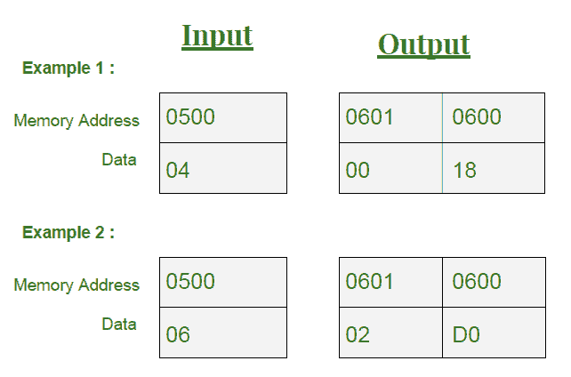

# 8086 程序求一个数的阶乘

> 原文:[https://www . geesforgeks . org/8086-program-find-factorial-number/](https://www.geeksforgeeks.org/8086-program-find-factorial-number/)

先决条件–[8085 求一个数的阶乘的程序](https://www.geeksforgeeks.org/assembly-language-program-8085-microprocessor-find-factorial-number/)
**问题–**用 8086 微处理器编写一个计算一个数的阶乘的汇编语言程序

**示例–**

```
Input : 04H
Output : 18H
as In Decimal : 4*3*2*1 = 24
   In Hexadecimal : 24 = 18H

Input : 06H
Output : 02D0H
as In Decimal : 6*5*4*3*2*1 = 720
   In Hexadecimal : 720 = 02D0H
```

**假设–**
程序起始地址:0400
输入内存位置:0500
输出内存位置:0600 和 0601

**重要–**
如果给定数字是 16 位数字，AX 寄存器将自动用作第二个参数，并且乘积存储在 DX:AX 寄存器对中。这意味着 DX 寄存器保存 32 位数字的高电平部分，AX 寄存器保存低电平部分。



在 8086 微处理器中，用户有直接指令(MUL)将两个数字相乘，所以我们不必像在 8085 中那样将被乘数乘以乘数

**8086 比 8085 的优势(在乘法的情况下):**

*   不需要编写庞大的代码，因为 8086 的代码很小
*   容易记住
*   已经有乘法指令

**算法–**

1.  输入要求其阶乘的数，并将该数存储在 CX 寄存器中(循环指令的条件)
2.  在 AX 中插入 0001(MUL 指令的条件)，在 DX 中插入 0000
3.  使用循环指令将 CX 与 AX 相乘，直到 CX 变为零(0)
4.  将 AX 的内容复制到内存位置 0600
5.  将 DX 的内容复制到内存位置 0601
6.  停止执行

**程序–**

<center>

| 地址 | 记忆术 | 评论 |
| --- | --- | --- |
| 0400 | CX mov[0500] | CX |
| 0404 | mov ax.0001 | AX |
| 0407 | 移动 DX， 0000 | DX |
| 040A | 我有客户体验 | DX:AX |
| 040C | LOOP 040A | 去[040A]直到 CX->00 |
| 0410 | MOV [0600]，AX | [0600] |
| 0414 | 移动 [0601]， DX | [0601] |
| 0418 | HLT | 停止执行 |

</center>

**解释–**

1.  **MOV CX，[0500]** 将 0500 内存位置内容加载到 CX 寄存器
2.  **MOV AX，0001** 用 0001 加载 AX 寄存器
3.  **MOV DX，0000** 用 0000 加载 DX 寄存器
4.  **MUL CX** 将 AX 与 CX 相乘，并将结果存储在 DX:AX 对中
5.  **循环 040A** 运行循环直到 CX 不等于零
6.  **MOV【0600】，AX** 将 AX 寄存器内容存储到内存位置 0600
7.  **MOV【0601】，DX** 将 DX 寄存器内容存储到存储单元 0601
8.  **HLT** 停止程序执行