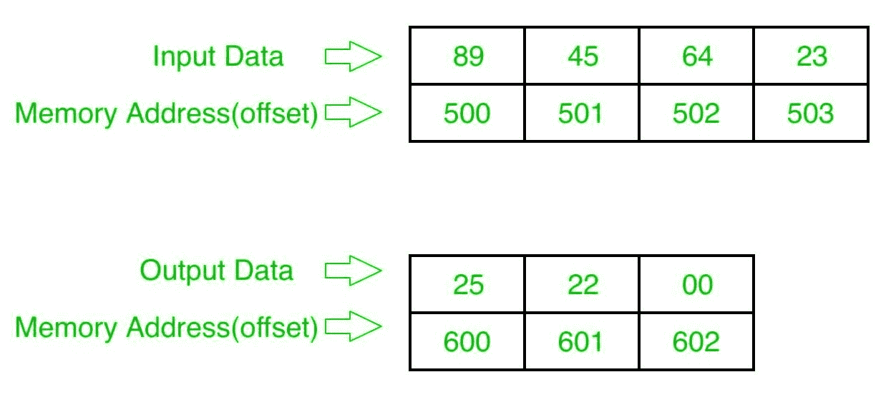

# 8086 程序减去两个 16 位 BCD 号

> 原文:[https://www . geesforgeks . org/8086-program-减法-二-16 位-bcd-numbers/](https://www.geeksforgeeks.org/8086-program-subtract-two-16-bit-bcd-numbers/)

先决条件–[8086 程序减去两个 8 位 BCD 数](https://www.geeksforgeeks.org/8086-program-subtract-two-8-bit-bcd-numbers/)
**问题–**在 8086 微处理器中编写一个程序，找出两个 16 位 BCD 数的减法，其中数字从起始偏移量 500 开始存储，并将结果存储到偏移量 600。

**示例–**

**算法–**

1.  将数据从偏移量 500 加载到寄存器 a1
2.  将数据从偏移量 502 加载到寄存器 BL
3.  减去这两个数字(寄存器 a1 和寄存器 BL 的内容)
4.  应用 DAS 指令(十进制调整)
5.  将结果(寄存器 a1 的内容)存储到偏移量 600
6.  将数据从偏移量 501 加载到寄存器 a1
7.  将数据从偏移量 503 加载到寄存器 BL
8.  用借位减去这两个数字。(寄存器 A1 和寄存器 BL 的内容)
9.  应用 DAS 指令(十进制调整)
10.  将结果(寄存器 a1 的内容)存储到偏移量 601
11.  将寄存器 A1 设置为 00
12.  用进位将寄存器 a1 的内容添加到自身
13.  将结果(寄存器 a1 的内容)存储到偏移量 602
14.  停止

**程序–**

| 存储地址 | 记忆术 | 评论 |
| --- | --- | --- |
| four hundred | MOV AL，[500] | AL |
| Four hundred and four | MOV BL，[502] | BL |
| Four hundred and eight | SUB AL， BL | AL |
| 40A | 这是什么 | 小数调整 |
| 40B | MOV [600]，第 1 段 | al >[600] |
| 40F | MOV AL，[501] | AL |
| Four hundred and thirteen | MOV BL，[503] | BL |
| Four hundred and seventeen | SBB AL，BL | 借出 |
| Four hundred and nineteen | 这是什么 | 小数调整 |
| 41A | MOV [601]，第 1 段 | al >[601] |
| 41E | 莫夫·阿尔·00 | -00 点 |
| Four hundred and twenty | ADC AL，AL .阿拉伯联合酋长国 | 铝 |
| Four hundred and twenty-two | MOV [602]号文件 | 一->[602] |
| Four hundred and twenty-six | HLT | 结束 |

**解释–**

1.  **MOV a1、【500】:**从偏移量 500 加载数据到寄存器 a1
2.  **MOV BL，[502]:** 从偏移量 502 加载数据到寄存器 BL
3.  **SUB a1，BL:** 减去寄存器 a1 和 BL 的内容
4.  **DAS:** 小数调整
5.  **MOV [600]，a1:**存储从寄存器 a1 到偏移 600 的数据
6.  **MOV a1、【501】:**从偏移量 501 加载数据到寄存器 a1
7.  **MOV BL，[503]:** 从偏移量 503 加载数据到寄存器 BL
8.  **SBB a1、B1:**用借位减去寄存器 a1 和 B1 的内容
9.  **DAS:** 小数调整
10.  **MOV [601]，a1:**存储从寄存器 a1 到偏移 601 的数据
11.  **MOV a1，00:** 将寄存器 a1 的值设置为 00
12.  **ADC a1、a1:**用进位将寄存器 a1 的内容加到 a1 上
13.  **MOV [601]，a1:**存储从寄存器 a1 到偏移 601 的数据
14.  **HLT:** 结束