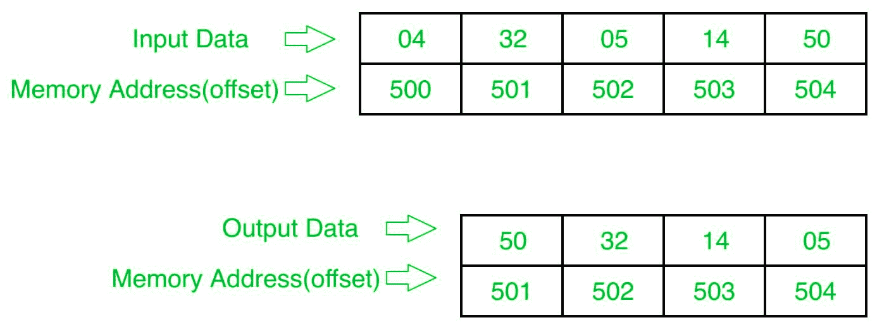

# 8086 程序对整数数组进行降序排序

> 原文:[https://www . geesforgeks . org/8086-程序对整数数组进行降序排序/](https://www.geeksforgeeks.org/8086-program-to-sort-an-integer-array-in-descending-order/)

**问题–**在 8086 微处理器中编写一个程序，对 n 个数字的数组中的数字进行降序排序，其中大小“n”存储在内存地址 2000 : 500，数字从内存地址 2000 : 501 开始存储。

**示例–**



示例说明:

```
*   **通行证-1:**32 05 14 50 32 05 14 50 32 14 05 50 32 14 50**05**(1 个号码搞定)*   **通行证-2:**32 14 50 05 32 14 50 05 32 50**14 05**(2 个号码已确定)*   **传球-3: ** 32 50 14 05 **50 32 14 05** (已排序)**算法–**1.  将数据从偏移量 500 加载到寄存器 C1(用于计数)。2.  从起始内存位置移动到最后，如果第一个数字小于第二个数字，比较两个数字，然后交换它们。3.  第一遍确定最后一个数字的位置。4.  将计数减少 1。5.  再次从起始存储位置移动到(倒数第一，借助计数)并比较两个数字，如果第一个数字小于第二个数字，则交换它们。6.  第二遍确定最后两个数字的位置。7.  重复。**程序–**

| 存储地址 | 记忆术 | 评论 |
| --- | --- | --- |
| four hundred | MOV 是，500 | 国际标准 |
| Four hundred and three | mov cl 是] | cl  |
| Four hundred and five | DEC CL | CL |
| Four hundred and seven | MOV 是，500 | 国际标准 |
| 40A | mov ch 是] | ch  |
| 40C | DEC CH | CH |
| 40E | 国际公司 | SI |
| 40F | MOV AL，[是] | al  |
| Four hundred and eleven | 国际公司 | SI |
| Four hundred and twelve | CMP AL，[是] | [是] |
| Four hundred and fourteen | jnc 41 足球俱乐部 | 跳到 41C 中频！=1 |
| Four hundred and sixteen | XCHG AL，[是] | 互换铝和硅 |
| Four hundred and eighteen | DEC SI | SI |
| Four hundred and nineteen | XCHG AL，[是] | 互换铝和硅 |
| 41B | 国际公司 | SI |
| 41C | DEC CH | CH |
| 41E | JNZ 40F 足球俱乐部 | 如果 ZF=0，跳到 40 华氏度 |
| Four hundred and twenty | DEC CL | CL |
| Four hundred and twenty-two | JNZ 407 | 如果 ZF=0，跳到 407 |
| Four hundred and twenty-four | HLT | 结束 |

**解释–**1.  **MOV SI，500** :将 SI 的值设置为 500。2.  **MOV CL、【SI】**:从偏移 SI 向寄存器 CL 加载数据。3.  **DEC CL** :寄存器 CL 的值减 1。4.  **MOV SI，500** :将 SI 的值设置为 500。5.  **MOV 通道，【S1】**:从偏移通道向寄存器通道加载数据。6.  **DEC 通道**:寄存器通道的值减少 1。7.  **INC SI**:SI 值增加 1。8.  **MOV a1、【SI】**:从偏移 SI 到寄存器 a1 的加载值。9.  **INC SI**:SI 值增加 1。10.  **CMP AL、【SI】**:比较寄存器 AL 和【SI】的值(AL-[SI])。11.  **JNC 41C** :未生成进位跳转到地址 41C。12.  **XCHG AL、【SI】**:交换寄存器 AL 和 SI 的内容。13.  **DEC SI**:SI 值减 1。14.  **XCHG AL、【SI】**:交换寄存器 AL 和 SI 的内容。15.  **INC SI**:SI 值增加 1。16.  **DEC CH** :寄存器 CH 的值减 1。17.  **JNZ 40F** :如果零平复位，跳转到地址 40F。18.  **DEC CL** :寄存器 CL 的值减 1。19.  **JNZ 407** :如果零平复位，跳转到地址 407。20.  **HLT** :停止。

```