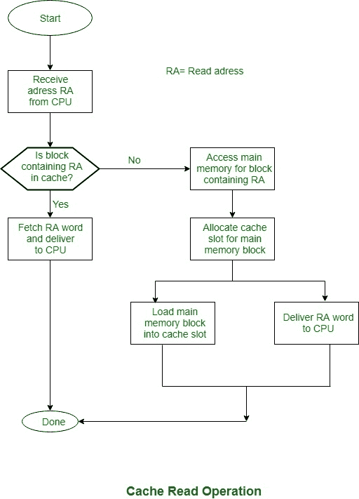

# 缓存设计

> 原文:[https://www.geeksforgeeks.org/cache-memory-design/](https://www.geeksforgeeks.org/cache-memory-design/)

先决条件–[缓存内存](https://www.geeksforgeeks.org/cache-memory/)
本文给出了缓存风格的详细讨论。这里简要总结了关键要素。我们将看到，类似的风格问题应该在解决存储和缓存风格时自行解决。它们代表后续类别:缓存大小、块大小、映射功能、替换算法和写入策略。这些解释如下。

1.  **缓存大小:**
    看起来适度微小的缓存对性能的影响会很大。
2.  **块大小:**
    块大小是缓存和主内存之间信息变化的单位。

由于块的大小将从非常小的大小增加到更大的大小，命中量级关系最初会由于局部性原则而增加。在不久的将来，记录的单词平方度量的知识被记录的可能性很大。随着块大小的增加，大量有用的知识被放入缓存。

然而，命中数量关系可能开始减小，因为块变得更大，并且牺牲新获取的知识的机会变得更小，但是重用应该从高速缓存中提取的信息以形成新块的区域的机会变得更小。

*   **Mapping Function:**
    When a replacement block of data is scan into the cache, the mapping performs determines that cache location the block will occupy. Two constraints have an effect on the planning of the mapping perform. First, once one block is scan in, another could be replaced.

    我们希望以最简单的方式做到这一点，以最大限度地减少我们将在不久的将来更换一个需要的区块的机会。很多通用的映射执行，很多范围，我们必须设计一个替换算法规则来最大化命中数量关系。第二，映射执行很多通用功能，很多高级功能是电子设备需要查看缓存，以查看给定的块是否在缓存中。

    *   **Replacement Algorithm:**
    The replacement algorithmic rule chooses, at intervals, the constraints of the mapping perform, which block to interchange once a replacement block is to be loaded into the cache and also the cache already has all slots full of alternative blocks. We would wish to replace the block that’s least possible to be required once more within the close to future. Although it’s impossible to spot such a block, a fairly effective strategy is to interchange the block that has been within the cache longest with no relevance.

    这一政策是因为最近最少使用的(LRU)算法规则。发现最近最少使用的块所需的硬件机制平方度量

    *   **Write Policy:**
    If the contents of a block within the cache square measure altered, then it’s necessary to write down it back to main memory before exchange it. The written policy dictates once the memory write operation takes place. At one extreme, the writing will occur whenever the block is updated.

    在相反的极端情况下，只有当块被替换时，写入才会发生。后一种策略最大限度地减少了内存写操作，但使主内存处于相关的过时状态。这会干扰多处理器操作和输入/输出硬件模块的直接操作。