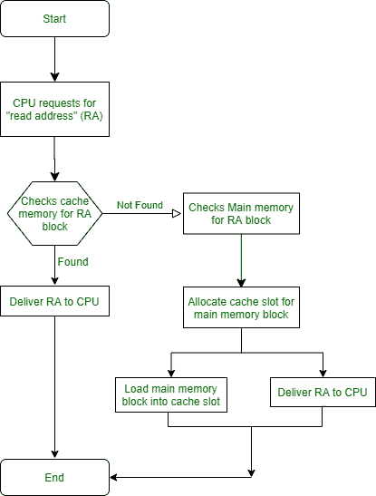

# 缓存设计概念

> 原文:[https://www . geesforgeks . org/cache-memory-design/](https://www.geeksforgeeks.org/concept-of-cache-memory-design/)

[高速缓冲存储器](https://www.geeksforgeeks.org/cache-memory-in-computer-organization/)通过提供对数据/指令的快速访问，在减少程序处理时间方面发挥了重要作用。缓存内存小而快，主存大而慢。

缓存的概念解释如下。

**缓存原则:**
缓存的目的是在不影响内存大小和价格的情况下，提供最快的资源访问。试图读取一个字节数据的处理器首先查看高速缓冲存储器。如果缓存内存中不存在该字节，它将在主内存中搜索该字节。一旦在主存储器中找到该字节，包含固定字节数的块被读入高速缓冲存储器，然后进入处理器。在高速缓冲存储器中找到后续字节的概率增加，因为较早读入高速缓冲存储器的块包含与该过程相关的字节，这是由于被称为“引用的局部性”或“局部性原则”的现象。

**缓存设计:**

1.  **Cache Size and Block Size –**
    To align with the processor speed, cache memories are very small so that it takes less time to find and fetch data. They are usually divided into multiple layers based on the architecture. The size of cache should accommodate the size of blocks, which are again determined by the processor’s architecture. When block size increase, hit ratio increases initially because of the principle of locality.

    导致将更多数据带入高速缓存的块大小的进一步增加将降低命中率，因为在某个时间点之后，使用由新块带入的新数据的概率小于重新使用正被清空以给新块腾出空间的数据的概率。

2.  **Mapping function –**
    When a block of data is read from the main memory, the mapping function decides which location in the cache gets occupied by the read-in main memory block. There will be a need to replace the cache memory block with the main memory block if the cache is full and this rises to complexities. Which cache block should be replaced?

    应注意不要替换更有可能被处理器引用的缓存块。替换算法直接依赖于映射函数，使得如果映射函数更灵活，替换算法将提供最大命中率。但是，为了提供更大的灵活性，搜索高速缓冲存储器以确定块是否在高速缓冲存储器中的电路的复杂性增加了。

3.  **[替换算法](https://www.geeksforgeeks.org/page-replacement-algorithms-in-operating-systems/)–**
    它在缓存满的情况下，根据映射函数的一定约束，决定缓存中的哪个块被主内存中的读入块替换。在不久的将来不会被引用的缓存块应该被替换，但是确定哪个块不会被引用是非常不可能的。因此，高速缓存中长时间未被引用的块应该被来自主存储器的新的读入块替换。这被称为最近最少使用的算法。
4.  **Write Policy –**
    One of the most important aspect of memory caching. The block of data from cache that is chosen to be replaced by the new read-in main memory block should first be placed back in the main memory. This is to prevent loss of data. A decision should be made when the cache memory block would be put back in the main memory.

    这两个可用选项如下

    1.  当从主存储器中选择用新的读入块替换高速缓存块时，将高速缓存块放在主存储器中。
    2.  每次更新块后，将缓存块放入主存储器。

    写策略决定何时将缓存块写回主内存。如果选择选项 1，则在主存储器上执行过多的写操作。如果选择选项 2，在多处理器系统的情况下，主存储器中的块是过时的，因为它还没有从高速缓冲存储器中被替换，但是它已经经历了改变。

    **示例:**

    *   什么是命中率？
        点击次数(在缓存中成功搜索)/总尝试次数(总搜索)。
    *   什么是 LRU 算法？
        [更多详情这里](https://www.geeksforgeeks.org/lru-cache-implementation/)
    *   有哪些不同的缓存层？
        [更多详情这里](https://searchstorage.techtarget.com/definition/cache-memory)和[这里](https://www.geeksforgeeks.org/multilevel-cache-organisation/?ref=rp)。
5.  如何在我的 Windows PC 中检查缓存内存的不同层？
    开放式任务管理器- >性能- >中央处理器(示例-L1、L2、L3)