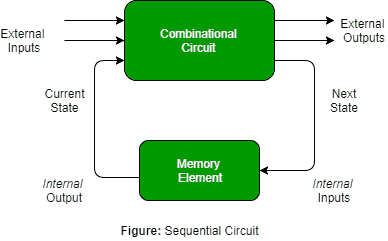

# 组合电路和时序电路的区别

> 原文:[https://www . geesforgeks . org/组合和时序电路之间的差异/](https://www.geeksforgeeks.org/difference-between-combinational-and-sequential-circuit/)

先决条件–[使用解码器的组合电路](https://www.geeksforgeeks.org/combinational-circuits-using-decoder/)、[时序电路介绍](https://www.geeksforgeeks.org/digital-logic-introduction-sequential-circuits/)
**组合电路**被定义为不依赖于先前输入产生任何输出的时间无关电路，称为组合电路。**时序电路**是那些依赖于时钟周期并依赖于当前和过去的输入来产生任何输出的电路。

**组合电路–**

1.  在这种情况下，输出仅取决于当前的输入。
2.  速度很快。
3.  它设计简单。
4.  输入和输出之间没有反馈。
5.  这是独立于时间的。
6.  基本构件:逻辑门
7.  用于算术和布尔运算。
8.  组合电路不具备存储任何状态的能力。
9.  由于组合电路没有时钟，所以不需要触发。
10.  这些电路没有任何存储元件。
11.  它易于使用和处理。

**示例–**编码器、解码器、复用器、解复用器

**框图–**

**时序电路–**

1.  在这种情况下，输出取决于现在和过去的输入。
2.  速度很慢。
3.  与组合电路相比，它的设计很难。
4.  输入和输出之间存在反馈路径。
5.  这取决于时间。
6.  基本构件:触发器
7.  主要用于存储数据。
8.  时序电路具有存储任何状态或保持早期状态的能力。
9.  由于时序电路依赖于时钟，因此需要触发。
10.  这些电路有记忆元件。
11.  它不容易使用和处理。

    **示例–**触发器、计数器

    **框图–**

    