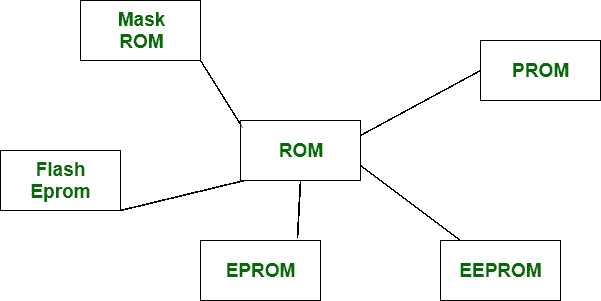

# EPROM 和 EEPROM 的区别

> 原文:[https://www . geesforgeks . org/eprom 和 eeprom 的区别/](https://www.geeksforgeeks.org/difference-between-eprom-and-eeprom/)

**EPROM** (可擦除可编程只读存储器)也是一种光学读写的只读存储器。为了写入相关的 EPROM，其存储单元应该保持在相同的初始状态。与可编程只读存储器相比，可编程只读存储器的存储持久性降低，因为可编程只读存储器容易受到辐射和电噪声的影响。在 EPROM 的构造中，使用了 MOS 晶体管。

在 **EEPROM** (电可擦除可编程只读存储器)中，电信号用于擦除 EEPROM 的内容。电可擦可编程只读存储器可以是一种非易失性存储器，尽管其能力有所改变，但仍能保留其内容。它存储了用于笔记本电脑/计算机基本输入输出系统的少量信息。它绝对是可编程只读存储器和可编程只读存储器的替代品。

EPROM 和 EEPROM 的主要区别在于，EPROM 的内容是用紫外线擦除的。另一方面，通过使用电信号擦除 EEPROM 的内容。

让我们看看-EPROM 和 EEPROM 的区别:

| S.NO | 可擦可编程只读存储器 | 电可擦可编程只读存储器 |
| --- | --- | --- |
| 1. | 在电子顺磁共振中，紫外光被用来擦除电子顺磁共振的内容。 | 在电可擦可编程只读存储器中，电信号被用来擦除电可擦可编程只读存储器的内容。 |
| 2. | EPROM 包括顶部的一个水晶窗口。 | 电可擦可编程只读存储器区域单元完全套在一个不透明的塑料盒中。 |
| 3. | EPROM 中单元的相对大小是 1。 | EEPROM 中单元的相对大小为 3。 |
| 4. | EPROM 是 PROM 的现代版。 | EEPROM 是 EPROM 的现代版本。 |
| 5. | EPROM 是外部编程。 | EEPROM 是外部编程。 |
| 6. | 一旦 EPROM 存储器被擦除，那么它可以被重新编程。 | EEPROM 也像 EPROM 一样擦除后重新编程。 |
| 7. | 电子顺磁共振中使用的晶体管消耗 12.5 伏。 | EEPROM 中使用的晶体管消耗 5 伏电压。 |
| 8. | 在 EPROM 中，采用热电子注入编程技术。 | 在 EEPROM 中，隧道效应被用作编程技术。 |
| 9. | 在 EPROM 中，擦除内容需要 15 到 20 分钟。 | 在 EEPROM 中，擦除内容需要 5 毫秒的时间。 |
| 10. | 电子顺磁共振芯片必须从计算机电路中移除，以擦除和重新编程计算机的基本输入输出系统。 | 电子可编程只读存储器芯片将在电路内被擦除和重新编程，以擦除和重新编程计算机基本输入输出系统的内容。 |

