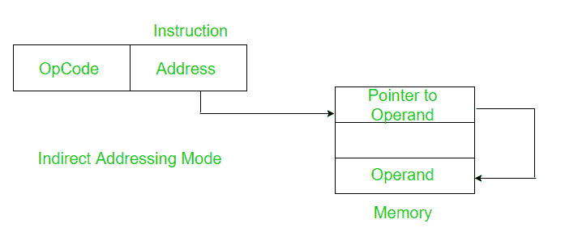

# 间接寻址模式和隐含寻址模式的区别

> 原文:[https://www . geesforgeks . org/间接寻址和隐含寻址模式之间的区别/](https://www.geeksforgeeks.org/difference-between-indirect-and-implied-addressing-modes/)

先决条件–[寻址模式](https://www.geeksforgeeks.org/addressing-modes/)

**1。<u>间接寻址模式</u> :**
这是指令包含目标地址存储位置地址的寻址模式。因此，通过这种方式，它将目标位置的地址间接存储在另一个存储位置。所以称之为间接寻址模式。



间接寻址模式有两种类型(或版本):内存间接寻址和寄存器间接寻址。

**1。内存间接–**
在这种类型中，我们直接在指令中提到内存位置的地址，或者用括号括起来，或者在前面加上“@”字符。

**示例:**

```
LOAD R1, (1005) 
or 
LOAD R1, @1005 
```

**2。寄存器间接–**
在这种类型中，目标存储单元的地址将存储在寄存器中，并且该寄存器将在指令中提及。

**示例:**

```
MOV R@, 1005
LOAD R1, (R2) 
```

**2。<u>隐含寻址模式</u> :**
这是指令定义中隐含指定操作数的寻址模式。这种寻址模式通常用于零地址(例如堆栈操作)和一地址(例如 MUL AL)指令。因此，操作数隐含在指令中，称为隐含寻址模式。

**示例:**

```
MOV CL, 05
L1: INC AL
    LOOP L1 
```

这里，每次循环执行时，a1 将增加 1。因此，指令 INC AL 中隐含了 1。

**间接和隐含寻址方式的区别:**

<figure class="table">

| Sl。不 | 间接寻址模式 | 隐含寻址模式 |
| --- | --- | --- |
| 1. | 使用多个内存空间。 | 无记忆干预 |
| 2. | 操作数是显式的 | 操作数是隐式的 |
| 3. | 主要用于 2 个地址指令及更多 | 主要用于零地址和单地址指令 |
| 4. | 需要 3 个内存引用 | 不需要内存引用 |
| 5. | 地址空间很大 | 地址空间很小 |
| 6. | 额外的计算是执行操作的唯一方法 | 不需要额外的计算 |
| 7. | 执行速度比较慢 | 执行速度更快 |

</figure>