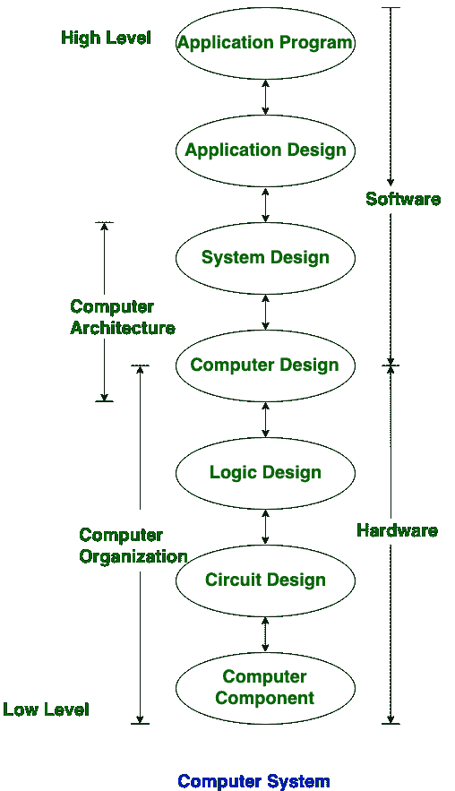

# 计算机架构和计算机组织的区别

> 原文:[https://www . geeksforgeeks . org/计算机体系结构和计算机组织之间的差异/](https://www.geeksforgeeks.org/differences-between-computer-architecture-and-computer-organization/)

**计算机体系结构:**
计算机体系结构是对计算机各个部分的需求和设计实现的功能描述。它处理计算机系统的功能行为。在设计计算机时，它出现在计算机组织之前。

> 体系结构描述了计算机的功能。

**计算机组织:**
计算机组织首先是在计算机体系结构确定之后。计算机组织是如何将操作属性联系在一起，并有助于实现架构规范。计算机组织处理结构关系。

> 组织描述了它是如何做到的。

现在，让我们看看计算机体系结构和计算机组织之间的区别:

<figure class="table">

| S.NO | 计算机体系结构 | 计算机组织 |
| 1. | 体系结构描述了计算机的功能。 | 组织描述了它是如何做到的。 |
| 2. | 计算机体系结构处理计算机系统的功能行为。 | 计算机组织处理结构关系。 |
| 3. | 在上图中，很明显它处理的是高级设计问题。 | 在上图中，也很明显，它处理的是低级设计问题。 |
| 4. | 架构表示它的硬件。 | 其中，组织表示其绩效。 |
| 5. | 对于设计一台计算机，它的体系结构首先是固定的。 | 对于设计一台计算机来说，组织是由它的结构决定的。 |
| 6. | 计算机体系结构也被称为指令集体系结构。 | 计算机组织通常被称为微体系结构。 |
| 7. | 计算机体系结构包括逻辑功能，如指令集、寄存器、数据类型和寻址模式。 | 计算机组织由电路设计、外围设备和加法器等物理单元组成。 |
| 8. | 体系结构协调系统的硬件和软件。 | 计算机组织处理系统中的网络部分。 |

</figure>