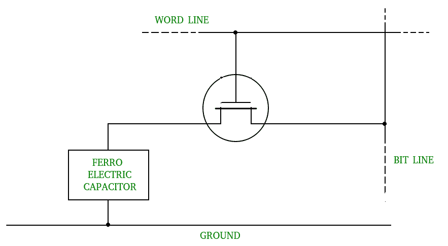

# 铁电随机存取存储器

> 原文:[https://www . geesforgeks . org/ferro-electric-random-access-memory/](https://www.geeksforgeeks.org/ferro-electric-random-access-memory/)

**铁电随机存取存储器( **FRAM** )** 是一种[随机存取存储器](https://www.geeksforgeeks.org/random-access-memory-ram-and-read-only-memory-rom/)，它使用铁电电容器来实现其非易失性(断电时内容不会丢失)。铁电材料的双电常数通常很高。最广泛使用的铁电材料是 PZT(锆钛酸铅)。由于该层是铁电的，看起来它可能含铁，但实际上它不含铁。

FRAM 的基本结构类似于动态随机存取存储器，唯一的区别是双电层被铁电层取代。为了执行读、写和存储操作，它由位线、字线、晶体管和铁电层组成。

铁电材料的电容是可变的。如果施加电场时开关关闭，它会以正常的线性方式运行。如果在铁电晶体层上施加电场时开关打开，中心原子开始向场的方向移动。在其路径的某个点，原子超过能量阈值，导致电荷激增。内部电路检测到这种电荷尖峰，并设置存储器。现在，如果我们去掉电场，当中心原子停留在它的位置时，记忆的状态被保留下来。由于这种记忆的保存，我们说 FRAM 是非易失性的。

[随机存取存储器](https://www.geeksforgeeks.org/different-types-ram-random-access-memory/)(例如。动态随机存取存储器，静态随机存取存储器)的优点是它有快速的读/写访问，但它本质上是易失性的，这意味着我们需要一个恒定的电源来维护内存中的数据。另一方面，只读存储器(例如。EEPROM、FLASH)具有非易失性的优点，但同时，与 RAM 相比，速度非常慢。FRAM 结合了这两种存储器的优点，这意味着它是非易失性的，并且具有快速的读/写访问。

FRAM 的关键**特征是:**

*   功耗更低。
*   能耐受辐射。
*   比其他内存类型更安全。
*   对读/写周期具有高耐久性。
*   像静态随机存取存储器一样是可重写的。
*   比磁存储器便宜。

FRAM 的整体**表现**可以**增加**:

*   缩小它的尺寸。
*   提高存储密度。
*   改进制造工艺，使铁电层不易退化。