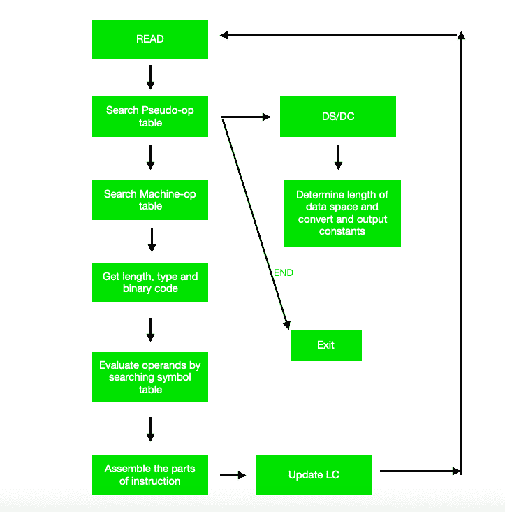
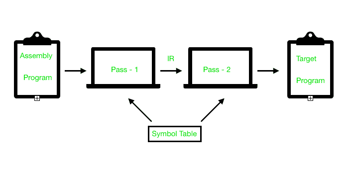

# 汇编器介绍

> 原文:[https://www.geeksforgeeks.org/introduction-of-assembler/](https://www.geeksforgeeks.org/introduction-of-assembler/)

**汇编程序**是将低级汇编代码编写的指令转换为可重定位的机器码，并为加载程序生成伴随信息的程序。


它通过计算操作字段中的助记符(符号)来生成指令，并找到符号和文字的值来生成机器代码。现在，如果汇编程序在一次扫描中完成所有这些工作，那么它被称为单程汇编程序，否则如果它在多次扫描中完成所有这些工作，那么它被称为多程汇编程序。这里，汇编程序将这些任务分为两个阶段:

*   **传球-1:**
    1.  定义符号和文字，并分别在符号表和文字表中记住它们。
    2.  跟踪位置计数器
    3.  处理伪操作
*   **传球-2:**
    1.  通过将符号操作码转换为相应的数字操作码来生成目标代码
    2.  为文字生成数据并查找符号值

首先，我们将采取一个小的汇编语言程序来理解他们各自通行证的工作。汇编语言语句格式:

```
[Label] [Opcode] [operand]

Example:  M  ADD  R1, ='3'
where, M - Label; ADD - symbolic opcode; 
R1 - symbolic register operand; (='3') - Literal

Assembly Program:
Label  Op-code   operand   LC value(Location counter)
JOHN   START     200
       MOVER     R1, ='3'    200
       MOVEM     R1, X       201
L1     MOVER     R2, ='2'    202
       LTORG                 203
X      DS        1           204
       END                   205

```

让我们来看看这个程序是如何工作的:

1.  **START:** 该指令从位置 200 开始执行程序，带有 START 的标签为程序提供名称。(约翰是项目名称)
2.  **MOVER:** 它将文字(='3 ')的内容移入寄存器操作数 R1。
3.  **MOVEM:** 将寄存器内容移入内存操作数(X)。
4.  **MOVER:** 它再次将文字(='2 ')的内容移入寄存器操作数 R2，其标签被指定为 L1。
5.  **LTORG:** 它给文字(当前 LC 值)分配地址。
6.  **DS(数据空间):**它将数据空间 1 分配给符号 x
7.  **END:** 完成程序执行。

**Pass-1 的工作:**定义符号和文字表及其地址。
注:文字地址由 LTORG 或 END 指定。

**步骤 1:开始 200** (这里没有找到符号或文字，所以两个表都是空的)

**步骤-2: MOVER R1，= ' 3 ' 200**(= ' 3 '是一个文字，所以制作了文字表)

<center>

| 逐字的 | 地址 |
| --- | --- |
| =’3′ | – – – |

</center>

**步骤-3: MOVEM R1，X 201**
X 是在声明之前引用的符号，因此它存储在带有空白地址字段的符号表中。

<center>

| 标志 | 地址 |
| --- | --- |
| X | – – – |

**步骤-4: L1 MOVER R2，='2 ' 202**
L1 是一个标签，= ' 2 '是一个文字，因此将它们存储在各自的表中

<center>

| 标志 | 地址 |
| --- | --- |
| X | – – – |
| 腰神经 2 | Two hundred and two |

</center>

<center>

| 逐字的 | 地址 |
| --- | --- |
| =’3′ | – – – |
| =’2′ | – – – |

</center>

**步骤-5: LTORG 203**
将地址分配给 LC 值指定的第一个文字，即 203

<center>

| 逐字的 | 地址 |
| --- | --- |
| =’3′ | Two hundred and three |
| =’2′ | – – – |

</center>

**Step-6: X DS 1 204**
它是一个数据声明语句，即 X 被赋予数据空间 1。但是 X 是一个符号，它在前面的步骤 3 中被引用，并在步骤 6 中被定义。这种情况称为前向引用问题，即变量在声明前被引用，可以通过后向修补来解决。所以现在汇编程序将把当前步骤的 LC 值指定的地址分配给 X。

<center>

| 标志 | 地址 |
| --- | --- |
| X | Two hundred and four |
| 腰神经 2 | Two hundred and two |

</center>

**第 7 步:END 205**
程序执行完毕，剩余文字将获得 END 指令的 LC 值指定的地址。这是由汇编程序的第 1 遍生成的完整符号和文字表。

<center>

| 标志 | 地址 |
| --- | --- |
| X | Two hundred and four |
| 腰神经 2 | Two hundred and two |

</center>

<center>

| 逐字的 | 地址 |
| --- | --- |
| =’3′ | Two hundred and three |
| =’2′ | Two hundred and five |

</center>

现在，由过程 1 生成的表连同它们的 LC 值将进入汇编程序的过程 2，以进一步处理伪操作码和机器操作码。

**Pass-2 的工作:**
汇编程序的 Pass-2 通过将符号机器操作码转换成它们各自的位配置(机器可理解的形式)来生成机器代码。它将所有机器操作码与符号代码、它们的长度和它们的位配置一起存储在 MOT 表(操作码表)中。它还将处理伪操作，并将它们存储在 POT 表(伪操作表)中。

pass-2 所需的各种数据库:

```
1\. MOT table(machine opcode table)
2\. POT table(pseudo opcode table)
3\. Base table(storing value of base register)
4\. LC ( location counter)

```

看一看流程图就明白了:



作为一个整体，汇编程序的工作原理如下:



</center>