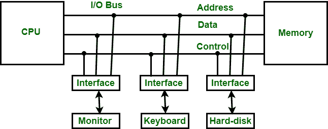

# 输入输出界面介绍

> 原文:[https://www . geesforgeks . org/introduction-to-input-output-interface/](https://www.geeksforgeeks.org/introduction-to-input-output-interface/)

[输入输出接口](https://www.geeksforgeeks.org/structure-of-input-output-interface/)是一种帮助在内部存储设备(即存储器和外部外围设备)之间传输信息的方法。外围设备是为计算机提供输入和输出的设备，也称为输入输出设备。例如:向计算机提供输入的键盘和鼠标称为输入设备，而向计算机提供输出的显示器和打印机称为输出设备。就像外部硬盘一样，也有一些外围设备可以提供输入和输出。

输入输出接口

在微型机基础系统中，外围设备的唯一目的只是提供**特殊的通信链路**，用于它们与中央处理器的接口。为了解决外围设备和中央处理器之间的差异，特别需要通信链路。

主要区别如下:

1.  外围设备的本质是电磁和机电的。CPU 的本质是电子的。外围设备和 CPU 的工作模式都有很大的不同。
2.  还有一个同步机制，因为外围设备的数据传输速率比 CPU 慢。
3.  在外围设备中，数据代码和格式不同于中央处理器和内存中的格式。
4.  外围设备的操作模式是不同的，并且每个都可以被控制，以便不干扰连接到中央处理器的其他外围设备的操作。

特别需要额外的硬件来解决中央处理器和外围设备之间的差异，以监控和同步所有输入和输出设备。

### 输入输出接口的功能:

1.  它用于同步中央处理器相对于输入输出设备的运行速度。
2.  它选择适合解释输入输出设备的输入输出设备。
3.  它能够提供控制和定时信号等信号。
4.  在这种情况下，可以通过数据总线进行数据缓冲。
5.  有各种错误检测器。
6.  它将串行数据转换为并行数据，反之亦然。
7.  它还将数字数据转换成模拟信号，反之亦然。