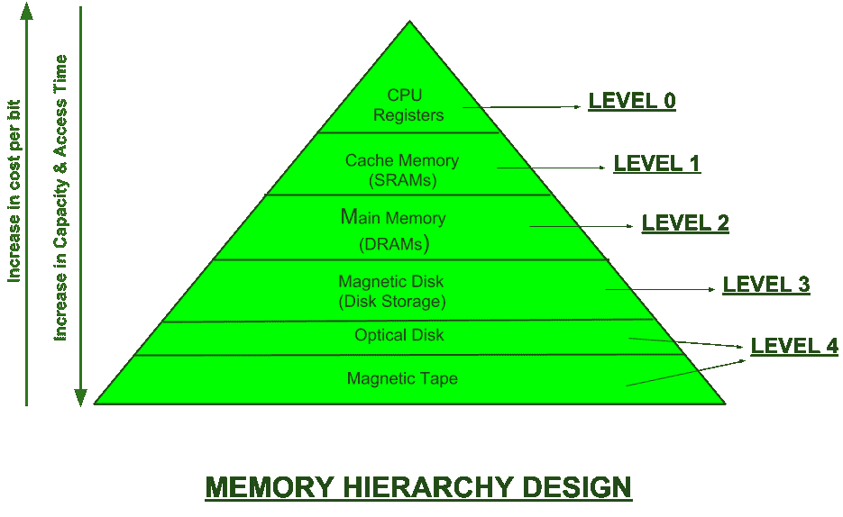

# 记忆层次设计及其特点

> 原文:[https://www . geesforgeks . org/memory-hierarchy-design-and-its-features/](https://www.geeksforgeeks.org/memory-hierarchy-design-and-its-characteristics/)

在计算机系统设计中，内存层次结构是对内存进行组织的一种增强，它可以最大限度地减少访问时间。内存层次结构是基于一种称为引用局部性的程序行为开发的。下图清楚地展示了不同级别的内存层次结构:

这种内存层次结构设计分为两种主要类型:

1.  **外部存储器或辅助存储器–**
    由磁盘、光盘、磁带组成，即处理器可通过输入/输出模块访问的外围存储设备。
2.  **内部存储器或主存储器–**
    包括主存储器、高速缓冲存储器&中央处理器寄存器。这可由处理器直接访问。

从上图我们可以推断出内存层次设计的以下特点:

1.  **容量:**
    是内存可以存储的全局信息量。当我们在层次结构中从上到下移动时，容量会增加。
2.  **访问时间:**
    指读/写请求和数据可用性之间的时间间隔。当我们在层次结构中从上到下移动时，访问时间会增加。
3.  **性能:**
    早些时候，计算机系统设计时没有内存层次结构设计，由于访问时间差异大，CPU 寄存器和主内存之间的速度差距增大。这导致系统性能降低，因此需要增强。这种增强是以内存层次设计的形式进行的，因此系统的性能得到了提高。提高系统性能最重要的方法之一是最大限度地减少操作数据所需的内存层次。
4.  **每比特成本:**
    当我们在层次结构中从下往上移动时，每比特成本增加，即内部存储器比外部存储器更贵。