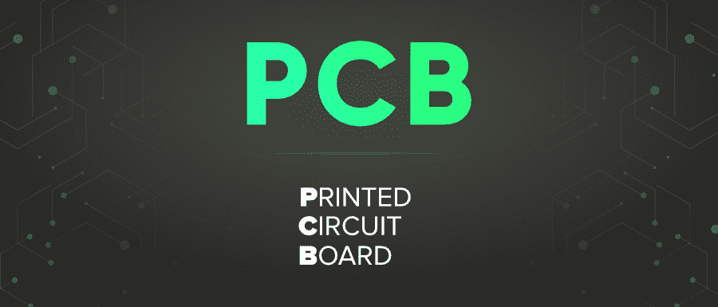

# 印刷电路板完整形式

> 原文:[https://www.geeksforgeeks.org/pcb-full-form/](https://www.geeksforgeeks.org/pcb-full-form/)

**PCB** 代表**印刷电路板**。印刷电路板是大多数电子产品中用作底座的电路板，同时也是物理支撑件。它们也用作插座式和表面安装式组件的布线区域。它们通常由复合环氧树脂、玻璃纤维或任何其他复合材料制成。大多数用于简单电子设备的印刷电路板都很简单，只有一层。像计算机主板或显卡这样的硬件可以有多层，最多可以有十二层。

#### 印刷电路板的历史

1936 年，奥地利工程师保罗·艾斯勒在英国工作时发明了印刷电路，这是收音机的一部分。在那之后，美国在第二次世界大战中使用它们制造近炸引信。第二次世界大战后，美国出于商业目的发布了这项发明。它们年复一年地被修改，今天它们被用在许多电子设备中。

#### 印刷电路板的特性

*   它的厅墙技术增强了它的能力
*   它的表面安装技术使元件更小，并在电路板的两侧组装
*   它的底座是由硬质材料制成的
*   它们由多层组成，每层都有自己的特点。

#### 印刷电路板的优势

*   避免紧密连接和短路。
*   低电子噪声。
*   低成本。
*   可重复使用。
*   易于维修和诊断。
*   寿命延长。
*   电路复杂度高。
*   可靠性。

#### 多氯联苯的缺点

*   不适合细间距*   热冲击*   一些印刷电路板表面很贵