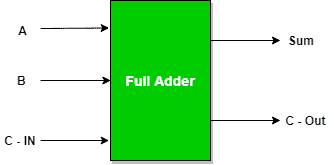
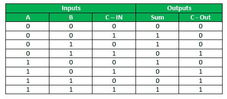

# Python 程序实现全加器

> 原文:[https://www . geesforgeks . org/python-程序到实现-全加器/](https://www.geeksforgeeks.org/python-program-to-implement-full-adder/)

**前提:** [**数字逻辑中的全加器**](https://www.geeksforgeeks.org/full-adder-in-digital-logic/)
给定全加器 A、B、C-IN 三路输入。任务是实现全加器电路和打印输出，即三个输入的和和。

**全加器:**全加器是对三个一位二进制数进行加法运算的逻辑电路。全加器产生三个输入和进位值的总和。



**逻辑表达式:**

```
SUM  =  C-IN  XOR  ( A XOR B )
C-0UT= A B + B C-IN + A C-IN
```

**真值表:**



**示例:**

```
Input : 0 1 1
Output: Sum=0, C-Out=1
```

根据逻辑表达式 Sum= C-IN XOR (A XOR B)即 1 XOR (0 XOR 1) =0，C-Out= A B + B C-IN + A C-IN 即 0 AND 1 + 1 AND 1 + 0 AND 1 = 1

```
Input : 1 0 0
Output: Sum=1, C-Out=0
```

**进场:**

*   我们接受三个输入 A、B 和 C-in。
*   应用 C-IN 异或(A 异或 B)给出和的值
*   应用一个 B + B C-IN +一个 C-IN 给出了 C-Out 的值

**下面是实现:**

## 蟒蛇 3

```
# python program to implement full adder

# Function to print sum and C-Out
def getResult(A, B, C):

    # Calculating value of sum
    Sum = C ^ (A ^ B)
    C
    # Calculating value of C-Out
    C_Out = Bin&(not(A ^ B))| not(A)&B

    # printing the values
    print("Sum = ", Sum)
    print("C-Out = ", C_Out)

# Driver code
A = 0
B = 0
C = 1
# passing three inputs of fulladder as arguments to get result function
getResult(A, B, C)
```

**输出:**

```
Sum =  1
C-Out =  0
```