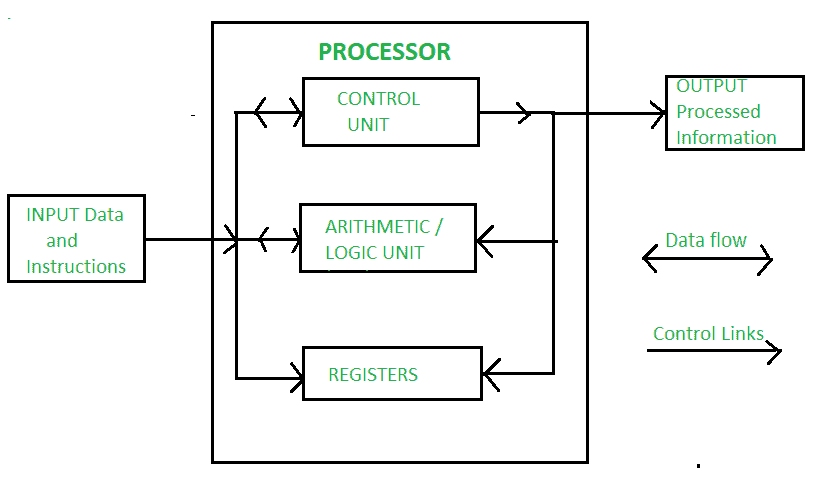

# 处理器在电脑中的角色

> 原文:[https://www.geeksforgeeks.org/role-of-processor-in-a-pc/](https://www.geeksforgeeks.org/role-of-processor-in-a-pc/)

处理器也称为中央处理器，是一种硬件。它通常被称为“个人电脑的大脑”，因为所有的计算和处理都是由包含数百万个晶体管的处理器直接或间接执行的。它是一个能够处理数据的单芯片。事实上，计算机系统的性能、能力和价格在很大程度上是由处理器决定的。它控制电脑中的所有组件。处理器的主要功能是–

1.  **Fetch–**
    每条指令都有自己的地址，存储在主内存中。中央处理器从存储器中的程序计数器中取出要执行的指令的地址，并执行该指令。

2.  **Decode–**
    将要执行的指令被转换成二进制代码，以便计算机能够容易地理解它并执行所需的功能。转换的过程被称为解码。

3.  **Execute–**
    执行指令中指定的所需任务的过程称为执行指令的执行在 CPU 中进行。

4.  **写回–**
    执行指令后，中央处理器将结果存储在内存中，该过程称为存储或写回。

**下图为** **处理器**的示意图

处理器在计算机系统的下列重要方面起着重要作用。

*   **性能–**
    处理器可能是个人电脑系统性能最单一的决定因素。而其他组件如内存、硬盘、显示适配器等。在决定性能方面起着关键作用，处理器的能力对系统的性能影响最大。处理器的内核和时钟速度决定了电脑的速度。它们告诉我们在多少时间内可以处理多少信息。事实上，系统中的其他设备发挥着它们的作用，让处理器发挥出全部潜力。

*   **软件支持–**
    更新、更快的处理器支持使用最新的软件，这为在我们的电脑上运行繁重的软件提供了支持，并通过高效工作和更快的处理速度节省了我们的时间。

*   **可靠性和稳定性–**
    处理器的质量是决定系统运行可靠性的一个因素。虽然大多数处理器是可靠的，但有些处理器还是不可靠。这在一定程度上还取决于处理器的年龄、处理器的能耗、主板、电源电压、冷却等。

*   **能耗和冷却–**
    与其他系统设备相比，原本处理器消耗的电能相对较少。但是一些处理器消耗大量的能量。从冷却设备的选择到整体系统的可靠性，功耗对一切都有影响。

*   **主板支持–**
    处理器是系统选择芯片组和主板类型的主要决定因素。主板反过来决定了系统能力和性能的许多方面。