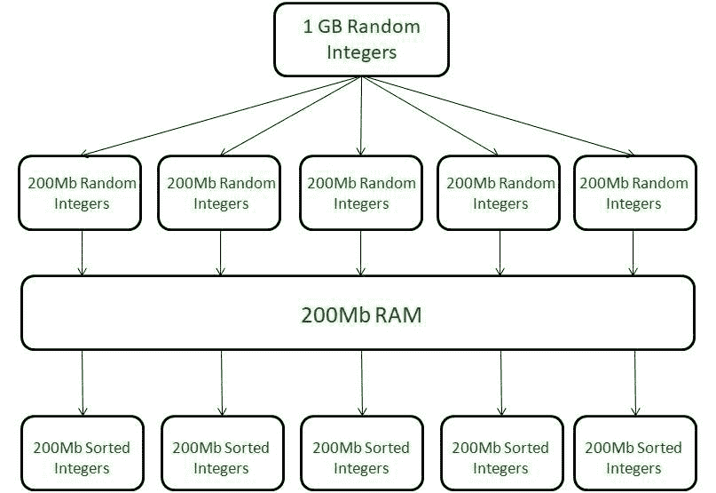

# 用较小的内存排序较大的文件

> 原文:[https://www . geeksforgeeks . org/sorting-大文件带小内存/](https://www.geeksforgeeks.org/sorting-larger-file-with-smaller-ram/)

假设我们要对一个 1GB 的随机整数文件进行排序，可用的 ram 大小为 200 Mb，该怎么做呢？

最简单的方法就是使用**外部排序**。
我们将源文件分成大小等于内存大小的临时文件，并首先对这些文件进行排序。
假设 1GB = 1024MB，那么我们按照以下步骤进行。

1.  将源文件分成 5 个小的临时文件，每个文件大小为 200MB(即等于 ram 的大小)。
2.  使用 ram 逐个对这些临时文件进行排序(任何排序算法:快速排序、合并排序)。

现在我们有了小的排序的临时文件，如下图所示。

**Figure –** Dividing source file in smaller sorted temp files

现在我们有了**排序的临时文件**。

1.  指针在每个文件中初始化
2.  创建大小为 1GB(源文件大小)的新文件。
3.  将每个文件中的第一个元素与指针进行比较。
4.  最小元素被复制到新的 1GB 文件中，指针在指向该最小元素的文件中递增。
5.  遵循相同的过程，直到所有指针都遍历了它们各自的文件。
6.  当所有的指针都遍历完了，我们就有了一个新文件，它有 1GB 的排序整数。

当[主内存(RAM)](https://www.geeksforgeeks.org/different-types-ram-random-access-memory/) 的大小有限制时，任何较大的文件都可以这样排序。

基本思想是将较大的文件分成较小的临时文件，对临时文件进行排序，然后使用这些临时文件创建一个新文件。这个问题是在 Infosys 对电源程序员的采访中提出的。