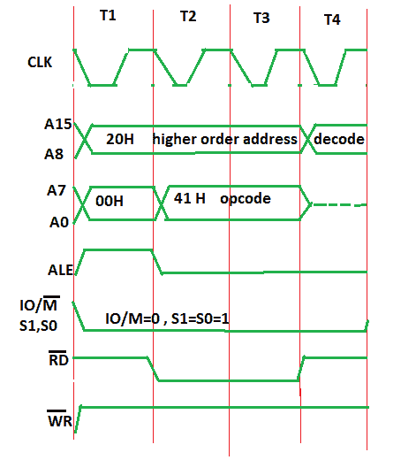

# 微处理器中 MOV 指令的时序图

> 原文:[https://www . geesforgeks . org/mov 指令微处理器时序图/](https://www.geeksforgeeks.org/timing-diagram-of-mov-instruction-in-microprocessor/)

**问题–**画出 8085 中给定指令的时序图，

```
MOV B, C 
```

给定指令将源寄存器的内容复制到目标寄存器中，并且源寄存器的内容不会改变。

**示例:**

```
MOV B, C
Opcode: MOV 
Operand: B and C 
```

Bis 是目的寄存器，C 是源寄存器，其内容需要传输到目的寄存器。

**算法–**
指令 MOV B、C 为 1 字节；因此，完整的指令将被存储在单个存储器地址中。例如:

```
2000: MOV B, C 
```

该指令只需要操作码提取，因此时序图需要 4 T 状态。对于操作码提取，输入输出/输出(低电平有效)= 0，S1 = 1，S0 = 1。

MOV 指令的时序图如下所示:



**在操作码提取(t1-t4 测试状态):**

1.  **00–**操作码存储地址的低位，即 00
2.  **20–**操作码存储地址的高位，即 20。
3.  **ALE–**为多路复用的地址和数据总线提供信号。只有在 t1 中，它用作地址总线来获取地址的低位，否则它将用作数据总线。
4.  **RD(低电平有效)–**信号在 t1 & t4 为 1，因为微处理器没有读取数据。t2 & t3 中的信号为 0，因为这里的数据由微处理器读取。
5.  **WR(低电平有效)–**信号始终为 1，微处理器未写入任何数据。
6.  **IO/M(低电平有效)–**信号始终为 1 in，因为操作正在内存上执行。
7.  在操作码提取的情况下， **S0 和 S1–**都是 1。