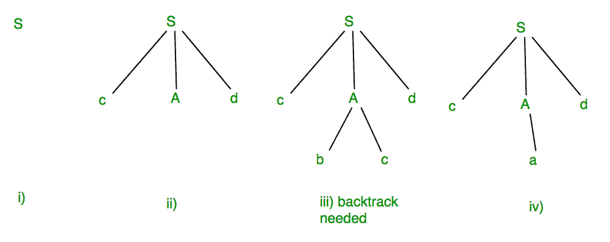

# 编译器设计中的语法分析介绍

> 原文:[https://www . geesforgeks . org/introduction-to-语法-分析-in-compiler-design/](https://www.geeksforgeeks.org/introduction-to-syntax-analysis-in-compiler-design/)

当输入字符串(源代码或某种语言的程序)被交给编译器时，编译器分几个阶段对其进行处理，从[词法分析](https://www.geeksforgeeks.org/introduction-of-lexical-analysis/)(扫描输入并将其划分为标记)开始，到目标代码生成。

句法分析或句法分析是第二阶段，即词汇分析之后。它检查给定输入的语法结构，即给定输入是否具有正确的语法(输入所用语言的语法)。它通过构建一个称为解析树或语法树的数据结构来实现这一点。解析树是使用语言的预定义语法和输入字符串构建的。如果可以在语法树的帮助下(在推导过程中)产生给定的输入字符串，则发现输入字符串的语法是正确的。如果没有，语法分析器将报告错误。

语言的语法由产生式规则组成。

<u>**例如:**</u>
假设一种语言的语法产生规则是:

```
  S -> cAd
  A -> bc|a
  And the input string is “cad”.
```

现在，解析器试图根据给定输入字符串的语法构建语法树。它使用给定的生产规则，并根据需要应用这些规则来生成字符串。要生成字符串“cad”，它使用给定图表中所示的规则:
[](https://media.geeksforgeeks.org/wp-content/uploads/Introduction-to-Syntax-Analysis.png)

在上面的第三步中，生产规则 A->bc 不适合应用(因为生成的字符串是“cbcd”而不是“cad”)，这里解析器需要回溯，并应用第四步中显示的 A 可用的下一个生产规则，然后生成字符串“cad”。

因此，给定的输入可以由给定的语法产生，因此输入在语法上是正确的。
但是需要回溯来获得正确的语法树，这确实是一个复杂的实现过程。

有一种更简单的方法可以解决这个问题，我们将在下一篇文章“编译器设计中 FIRST 和 FOLLOW 集合的概念”中看到。

[语法分析小测验](https://www.geeksforgeeks.org/parsing-and-syntax-directed-translation-gq/)

本文由 [**瓦伊巴夫巴派**](https://disqus.com/by/vaibhav2992/) 编撰。如果您发现任何不正确的地方，或者您想分享关于上面讨论的主题的更多信息，请写评论