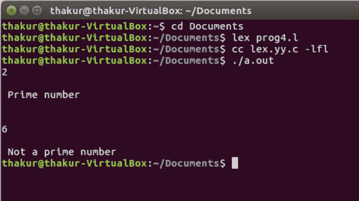

# Lex 程序检查一个数是否是质数

> 原文:[https://www . geesforgeks . org/lex-program-to-check-number-is-prime-or-not/](https://www.geeksforgeeks.org/lex-program-to-check-whether-a-number-is-prime-or-not/)

**问题:**写一个 Lex 程序，检查一个数是不是质数。

**解释:**
[Lex](https://www.geeksforgeeks.org/flex-fast-lexical-analyzer-generator/) 是一个生成词法分析器的计算机程序，由 Mike Lesk 和 Eric Schmidt 编写。Lex 读取指定词法分析器的输入流，并输出用 C 编程语言实现 lexer 的源代码。

**定义:** A [素数](https://www.geeksforgeeks.org/prime-numbers/)是大于 1 的整数，其唯一的因子是 1 和它本身。一个因子是一个整数，可以平均分成另一个数。前几个质数是:2，3，5，7，11，13，17，19，23 和 29。

**示例:**

```
Input: 2 
Output: Prime number

Input: 6
Output: Not a Prime number 
```

**实施:**

```
/* Lex Program to check whether a number is Prime or Not */

%{
   /* Definition section */
   #include<stdio.h>
   #include<stdlib.h>
   int flag,c,j;
%}

/* Rule Section */
%%
[0-9]+ {c=atoi(yytext);
         if(c==2)
         {
           printf("\n Prime number");
         }
         else if(c==0 || c==1)
         {
           printf("\n Not a Prime number");
         }
         else
         {
           for(j=2;j<c;j++)
         {  
         if(c%j==0)
           flag=1;
         }
         if(flag==1)
           printf("\n Not a prime number");
         else if(flag==0)
           printf("\n Prime number");
         }
       }
%%

// driver code
int main()
 {
  yylex();
  return 0;
 }
```

**输出:**

