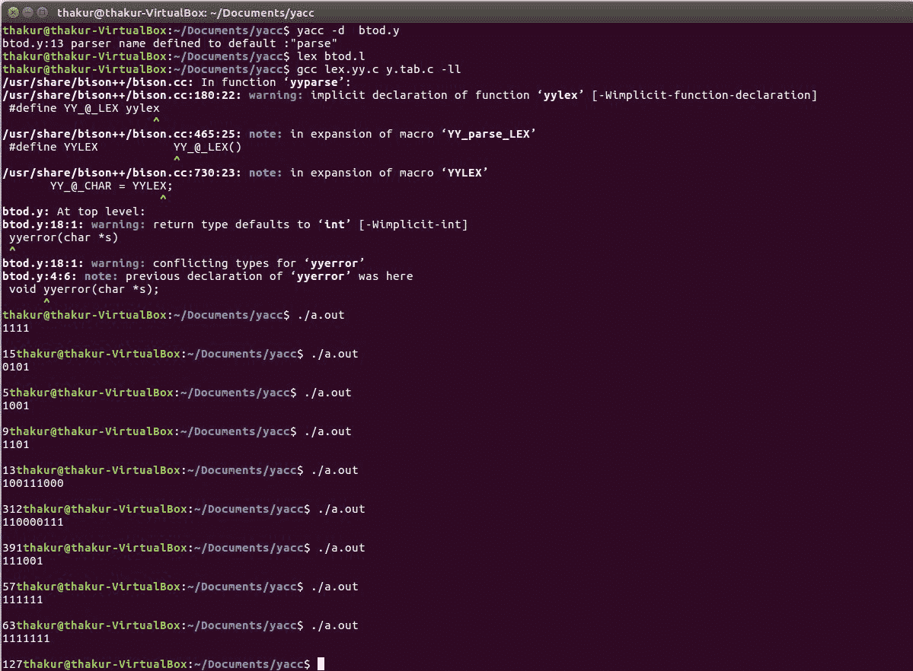

# 二进制到十进制转换的 YACC 程序

> 原文:[https://www . geeksforgeeks . org/yacc-用于二进制到十进制转换的程序/](https://www.geeksforgeeks.org/yacc-program-for-binary-to-decimal-conversion/)

**问题:**编写二进制到十进制转换的 YACC 程序。

**解释:**
[Yacc(为“又一个编译器编译器。”)](https://www.geeksforgeeks.org/introduction-to-yacc/)是 Unix 操作系统的标准解析器生成器。yacc 是一个开源程序，用 C 编程语言为解析器生成代码。首字母缩略词通常以小写形式呈现，但偶尔会被视为 YACC 或 Yacc。

**示例:**

```
Input: 0101
Output: 5

Input: 1101
Output: 13

Input: 111001
Output: 57

Input: 1111111
Output: 127

Input: 100111000
Output: 312 
```

**词法分析器源代码:**

```
%{
  /* Definition section */
  #include<stdio.h>
  #include<stdlib.h>
  #include"y.tab.h"
  extern int yylval;
%}

/* Rule Section */
 %%
 0 {yylval=0;return ZERO;}
 1 {yylval=1;return ONE;}

 [ \t] {;}
 \n return 0;
 . return yytext[0];
%%

int yywrap()  
 {  
  return 1;  
 }  
```

**解析器源代码:**

```
%{
  /* Definition section */
  #include<stdio.h>
  #include<stdlib.h>
  void yyerror(char *s);
%}
%token ZERO ONE

/* Rule Section */
%%
N: L {printf("\n%d", $);}
L: L B {$=$1*2+$2;}
| B {$=$1;}
B:ZERO {$=$1;}
|ONE {$=$1;};
%%

//driver code 
int main()
{
 while(yyparse());
}

yyerror(char *s)
{
 fprintf(stdout, "\n%s", s);
}

```

**输出:**

