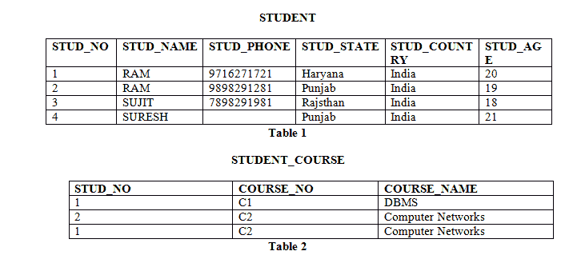

# 关系模型中的异常

> 原文:[https://www . geesforgeks . org/关系模型中的异常/](https://www.geeksforgeeks.org/anomalies-in-relational-model/)

我们强烈建议将以下帖子作为先决条件。
[DBMS |关系模型介绍和 Codd 规则](https://www.geeksforgeeks.org/introduction-of-relational-model-and-codd-rules-in-dbms/)
[DBMS |关系模型中的键(候选、超级、主要、替代和外来)](https://www.geeksforgeeks.org/types-of-keys-in-relational-model-candidate-super-primary-alternate-and-foreign/)

**异常**
在引用和被引用关系中可能出现不同类型的异常，可以讨论为:

**插入异常:**如果引用关系中插入了元组，且引用属性中不存在引用属性值，则不允许在引用关系中插入。例如，如果我们试图在 STUDENT_COURSE 中插入一条 STUD _ NO = 7 的记录，它将不允许。

**删除和更新异常:**如果从引用关系中删除或更新元组，引用属性值被引用关系中的引用属性使用，则不允许从引用关系中删除元组。例如，如果我们试图从 STUDENT 中删除一条 STUD _ NO = 1 的记录，它将不允许。为了避免这种情况，可以在查询中使用以下内容:

*   **ON DELETE/UPDATE SET NULL:** 如果从引用关系中删除或更新元组，引用属性值被引用关系中的引用属性使用，则从引用关系中删除/更新元组，并将引用属性值设置为 NULL。
*   **ON DELETE/UPDATE CASCADE:** 如果从引用关系中删除或更新元组，引用属性值被引用关系中的引用属性使用，那么它也会从引用关系和引用关系中删除/更新元组。

本文由 **Sonal Tuteja** 供稿。如果你喜欢 GeeksforGeeks 并想投稿，你也可以使用[write.geeksforgeeks.org](https://write.geeksforgeeks.org)写一篇文章或者把你的文章邮寄到 review-team@geeksforgeeks.org。看到你的文章出现在极客博客主页上，帮助其他极客。

如果你发现任何不正确的地方，或者你想分享更多关于上面讨论的话题的信息，请写评论。