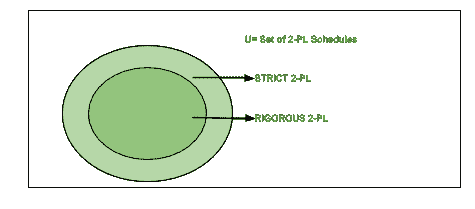

# 两相锁定类别(严格、严谨&保守)

> 原文:[https://www . geesforgeks . org/categories-of-two-phase-lock-strict-strict-conservative/](https://www.geeksforgeeks.org/categories-of-two-phase-locking-strict-rigorous-conservative/)

现在我们已经熟悉了什么是两相[锁定(2-PL)](https://www.geeksforgeeks.org/dbms-concurrency-control-protocols-two-phase-locking-2-pl/) 以及保证可串行化应该遵循的基本规则。此外，我们遇到了 2-PL、级联中止和死锁的问题。现在，我们转向在 2-PL 上所做的增强，它试图使协议几乎没有错误。简而言之，我们允许对 2-PL 进行一些修改来改进它。有三类:

1.  严格 2-PL
2.  严格的 2-PL
3.  保守的 2-PL

现在回想一下 Basic 2-PL 中遵循的规则，在此基础上我们做了一些额外的修改。现在让我们看看有哪些修改以及它们解决了哪些缺点。

### 严格的 2-PL–

这要求除了锁是 2 阶段的**之外，事务持有的所有独占(X)锁**在事务提交后被释放，直到*。
遵循严格的 2-PL 确保我们的时间表是:*

*   可恢复的
*   无级联

因此，它给了我们从级联中止的自由，级联中止仍然存在于基本 2-PL 中，而且保证了严格的调度，但是仍然，死锁是可能的！

### 严格的 2-PL–

这要求除了锁是 2 阶段的**之外，事务持有的所有独占(X)和共享(S)锁**在事务提交后被释放直到*。
遵循严格的 2-PL 确保我们的时间表是:*

*   可恢复的
*   无级联

因此，它给了我们从级联中止的自由，级联中止仍然存在于基本 2-PL 中，而且保证了严格的调度，但是仍然，死锁是可能的！

请注意，严格 2-PL 和严格 2-PL 的区别在于，严格的限制更严格，它要求独占锁和共享锁都保持到事务提交之后，这使得严格 2-PL 的实现更加容易。

### 保守的 2-PL–

A.也称为 **Static 2-PL** ，该协议要求事务通过预定义其读集和写集来锁定它在事务开始执行之前访问的所有项目。如果需要的任何预先声明的项目无法锁定，事务不会锁定任何项目，而是等待，直到所有项目都可以锁定。

保守的 2-PL 是*无死锁*，但是它不能保证严格的时间表(更多关于这个[在这里](https://www.geeksforgeeks.org/dbms-concurrency-control-protocol-two-phase-locking-2-pl-iii/)！).然而，在实践中很难使用，因为需要预先声明读集和写集，这在许多情况下是不可能的。在实践中，2-PL 最流行的变体是严格 2-PL。

下面的维恩图显示了严格的时间表分类。宇宙表示可以序列化为 2-PL 的计划。如图所示，也可以从逻辑上得出结论，如果一个时间表是严格的，那么它就是严格的。我们也可以用另一种方式思考，比如我们对一个时间表进行限制，使其严格，在限制列表中添加另一个，使其严格。花一点时间再次分析图表，你一定会得到它。

**图像–**维恩图，显示 2-PL 下的语言类别

现在，让我们看看下面的时间表，告诉我这个时间表是否可以使用 2-PL 锁定，如果可以，请显示您的答案属于 2-PL 的哪一类以及如何锁定？

<figure class="table">

|   | **T1T3】** | **T2T3】** |
| one | 阅读(一) |   |
| Two |   | 阅读(一) |
| three | 阅读(二) |   |
| four | 写(乙) |   |
| five | **提交** |   |
| six |   | 阅读(二) |
| seven |   | 写(乙) |
| six |   | **提交** |

我建议你在看解决方案之前先试试。
是的，调度是冲突可串行化的，所以我们可以尝试实现 2-PL。所以，让我们试试…

**解决方案:**

<figure class="table">

|   | **T1T3】** | **T2T3】** |
| one | 锁定开关 |   |
| Two | 阅读(一) |   |
| three |   | 锁定开关 |
| four |   | 阅读(一) |
| five | 锁-十(乙) |   |
| six | 阅读(二) |   |
| seven | 写(乙) |   |
| eight | **提交** |   |
| nine | 解锁(一) |   |
| Ten | 解锁(乙) |   |
| Eleven |   | 锁-十(乙) |
| Twelve |   | 阅读(二) |
| Thirteen |   | 写(乙) |
| Fourteen |   | **提交** |
| Fifteen |   | 解锁(一) |
| Sixteen |   | 解锁(乙) |

现在，这是我选择在 A 和 b 上实现锁的一种方法。您可以尝试不同的顺序，但请记住遵循 2-PL 协议。也就是说，观察我们的锁在提交操作后被释放，所以这满足严格的 2-PL 协议。

到目前为止，我猜你一定已经有了如何区分 2-PL 类型的想法。记住理论，因为考试中出现的问题有时只是基于理论知识。接下来，我们将看看保守 2-PL 的一些例子，以及它与上述两种类型的 2-PL 有何不同。是什么让它没有死锁，也很难实现。然后我们将结束 2-PL 的话题。很快我们将转向另一种类型的基于锁的协议——基于图的协议。它们也非常有趣，并提供了一种独特的方法来处理死锁问题！因此，我们将学习一种新型的锁定协议，这将结束基于锁定的 GATE 协议的主题，直到快乐学习。

**GATE 相关问题:**
[GATE CS | IT 2004 |问题 77](https://www.geeksforgeeks.org/gate-gate-it-2004-question-77/)

</figure>

</figure>