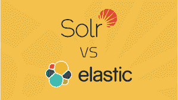

# 弹性搜索和 Solr 的区别

> 原文:[https://www . geesforgeks . org/elastic search-and-Solr 之间的差异/](https://www.geeksforgeeks.org/difference-between-elasticsearch-and-solr/)

**1。 [Elasticsearch](https://www.geeksforgeeks.org/elasticsearch-search-engine-an-introduction/) :**
它是一个全文搜索和开源引擎。它是独立于平台的，可以在任何平台上运行，因为它是基于 java 编程语言构建的。它允许用户以非常高的速度访问大量数据。

**2。Solr :**
它被用来构建搜索应用和一个开源平台。使用 Solr 构建的应用程序具有非常高的性能。Solr 与 Hadoop 一起使用，因为 Hadoop 处理大量数据，Solr 帮助我们从如此大的来源中找到所需的信息。

**弹性搜索和 Solr 的区别:**

| Solr | 弹性搜索 |
| --- | --- |
| 不支持 In solr 推送查询。 | 支持推送查询。 |
| 它不支持跨多个索引搜索。 | 它支持跨多个索引的搜索。 |
| 结果分组是可能的。 | 结果分组是不可能的。 |
| 它支持拼写检查。 | 它不支持拼写检查。 |
| 查询提升是可能的。 | 查询提升是不可能的。 |
| 它是为网络搜索而建的。 | 它是为可扩展搜索而构建的。 |
| 它支持重复数据消除。 | 它不支持重复数据消除。 |
| 它支持文档结构。 | 它支持嵌套对象。 |
| 在 solr 中，更新需要更改配置。 | 在弹性搜索中，更新需要自定义更改。 |
| 分析仪是预定义的。 | 分析器是在查询期间设置的。 |

