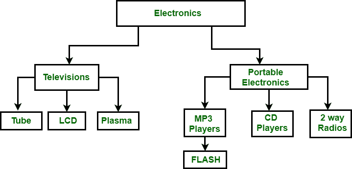
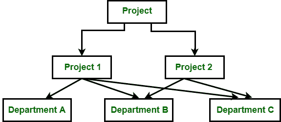
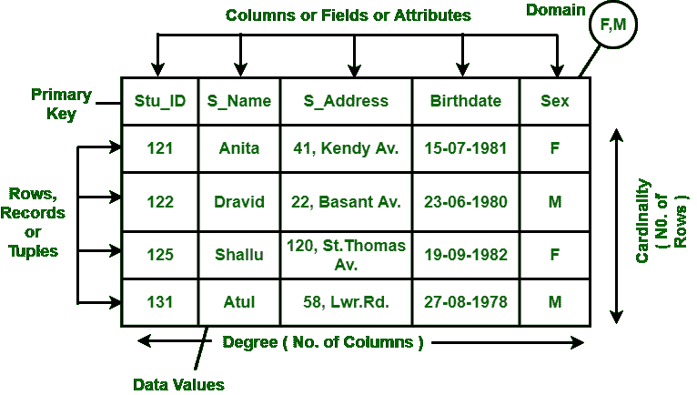

# 层次、网络和关系数据模型的区别

> 原文:[https://www . geesforgeks . org/分层网络和关系数据模型之间的差异/](https://www.geeksforgeeks.org/difference-between-hierarchical-network-and-relational-data-model/)

**1。分层数据模型:**
分层[数据模型](https://www.geeksforgeeks.org/data-models-in-dbms/)是最古老的数据模型类型。它是由 IBM 在 1968 年开发的。它以树状结构组织数据。分层模型由以下内容组成:

*   它包含由分支连接的节点。
*   最顶端的节点称为根节点。
*   如果有多个节点出现在顶层，那么这些可以称为根段。
*   每个节点只有一个父节点。
*   一个父母可能有多个孩子。

**Figure –** Hierarchical Data Model

在上图中，电子设备是根节点，它有两个子节点，即电视和便携式电子设备。这两个人有更多的孩子，他们作为父母。例如:电视有电视管、液晶电视和等离子电视，因为这三个电视充当家长。它遵循一对多的关系。

**2。网络数据模型:**
它是分层数据模型的高级版本。为了组织数据，它使用有向图而不是树形结构。在这个孩子可以有不止一个父母。它使用了两种数据结构的概念，即记录和集合。

**Figure –** Network Data Model

在上图中，项目是根节点，它有两个子节点，即项目 1 和项目 2。项目 1 有 3 个孩子，项目 2 有 2 个孩子。总共有 5 个孩子，即 A 部门、B 部门和 C 部门，他们是网络相关的孩子，正如我们所说的，这种模式可以有多个父母。所以，对于 B 系和 C 系有两个家长，即项目 1 和项目 2。

**3。关系数据模型:**
关系数据模型是由 E.F. Codd 在 1970 年开发的。它们没有物理链接，因为它们在分层数据模型中。以下是关系数据模型的属性:

*   数据仅以表格的形式表示。
*   它只处理数据，不处理物理结构。
*   它提供关于元数据的信息。
*   在行和列的交叉点上，元组只有一个值。
*   它提供了一种轻松处理查询的方法。

**Figure –** Relational Data Model

**分层、网络和关系数据模型的区别:**

| 分层数据模型 | 网络数据模型 | 关系数据模型 |
| --- | --- | --- |
| 在这个模型中，使用了存储数据的层次方法。这是最古老的方法，现在已经不用了。 | 它通过链接或指针组织记录。 | 它以表的形式组织记录，表之间的关系是使用公共字段设置的。 |
| 为了组织记录，它使用树形结构。 | 它以有向图的形式组织记录。 | 它以表格的形式组织记录。 |
| 它实现了 1:1 和 1:n 的关系。 | 除了 1:1 和 1:n，它还实现了多对多的关系。 | 除了 1:1 和 1:n，它还实现了多对多的关系。 |
| 此模型中存在插入异常，即没有父节点，无法插入子节点。 | 没有插入异常。 | 没有插入异常。 |
| 该模型存在删除异常，即很难删除父节点。 | 没有删除异常。 | 没有删除异常。 |
| 这种模型缺乏数据独立性。 | 该模型中存在部分数据独立性。 | 该模型提供了数据独立性。 |
| 它用于访问复杂且不对称的数据。 | 它用于访问复杂且对称的数据。 | 它用于访问复杂且对称的数据。 |
| &XML 和 XAML 使用这个模型。 | UNIVAC 的 VAX-数据库管理系统、DMS-1100 和超数据库管理系统都使用这种模型。 | 它主要用于现实世界的应用。甲骨文，SQL。 |

