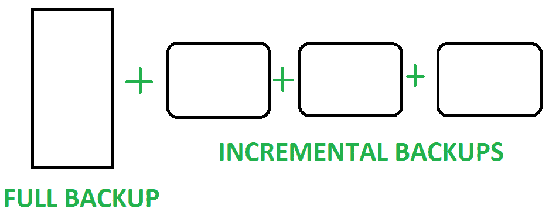
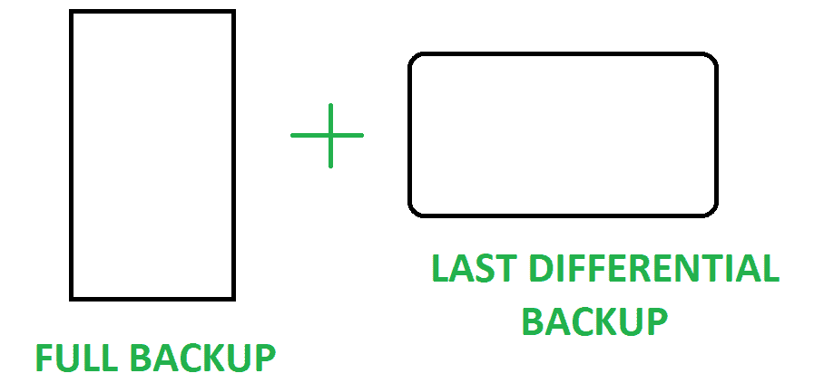

# 增量备份和差异备份的区别

> 原文:[https://www . geesforgeks . org/增量备份和差异备份的区别/](https://www.geeksforgeeks.org/difference-between-incremental-backup-and-differential-backup/)

**1。增量备份:**
增量备份仅保留自上次完全备份或增量备份以来已更改的数据。这种类型的备份使用较少的存储空间，可以快速进行备份和恢复。此类备份中的数据包含冗余，因为恢复包括上次完整备份和所有增量备份。

**增量备份中的恢复:**

**2。差异备份:**
差异备份仅保留自上次完整备份以来的数据更改。这种类型的备份使用更多的内存，因为它保存了自上次完全备份以来的所有数据更改。它包含较少的冗余数据，恢复很容易，但创建备份所需的时间很长。

**差异备份中的恢复:**

**增量备份和差异备份的区别:**

| 没有 | 增量备份 | 差异备份 |
| --- | --- | --- |
| 1. | 在这种类型的备份中，连续的数据拷贝只包含自上一次备份拷贝以来发生变化的部分。 | 在这种类型的备份中，只保存与上次完整备份的数据差异。 |
| 2. | 它比差异备份有更多的冗余数据。 | 差异备份包含较少的冗余数据。 |
| 3. | 在这种类型的备份中，恢复很困难。 | 与增量备份相比，恢复更容易。 |
| 4. | 创建备份花费的时间更少。 | 创建备份比增量备份需要更多的时间。 |
| 5. | 创建备份需要较少的数据存储空间。 | 与增量备份相比，创建备份所需的内存更多。 |
| 6. | 增量备份使用较少的带宽。 | 差异备份比增量备份使用更多的带宽。 |

