# 可扩展哈希(动态数据库管理系统方法)

> 原文:[https://www . geesforgeks . org/extensable-hashing-dynamic-approach-to-DBMS/](https://www.geeksforgeeks.org/extendible-hashing-dynamic-approach-to-dbms/)

**<u>【可扩展哈希】</u>** 是一种动态哈希方法，其中目录和桶用于哈希数据。这是一种非常灵活的方法，在这种方法中，哈希函数也会经历动态变化。

**<u>可扩展哈希的主要特性</u> :** 这种哈希技术的主要特性有:

*   **目录:**目录将桶的地址存储在指针中。为每个目录分配一个 id，该 id 可能会在每次进行目录扩展时发生变化。
*   **桶:**桶用于散列实际数据。

**<u>可扩展哈希的基本结构</u> :**

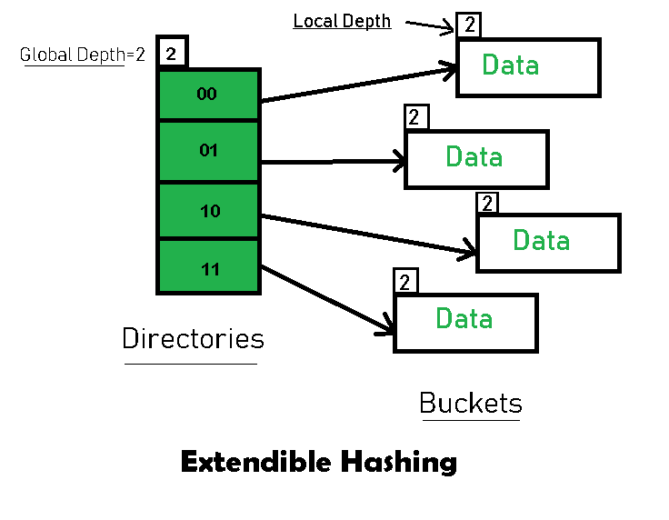

**<u>可扩展哈希中的常用术语</u> :**

*   **目录:**这些容器存储指向桶的指针。每个目录都有一个唯一的 id，这个 id 在每次扩展时都会改变。哈希函数返回这个目录 id，用于导航到适当的桶。目录数量= 2^Global 深度。
*   **桶:**它们存储散列的密钥。目录指向桶。如果桶的局部深度小于全局深度，则桶可能包含多个指向它的指针。
*   **全局深度:**与目录关联。它们表示哈希函数用来对密钥进行分类的位数。全局深度=目录 id 中的位数。
*   **局部深度:**与全局深度相同，只是局部深度与桶相关联，而不是与目录相关联。根据全局深度的局部深度用于决定在发生溢出的情况下要执行的动作。局部深度始终小于或等于全局深度。
*   **桶拆分:**当桶中的元素数量超过特定大小时，则桶被拆分为两部分。
*   **目录扩展:**当桶溢出时发生目录扩展。当溢出桶的局部深度等于全局深度时，执行目录扩展。

**<u>可扩展哈希的基本工作</u> :**

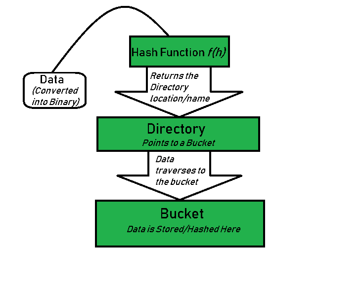

*   **步骤 1–分析数据元素:**数据元素可能以各种形式存在，例如整数、字符串、浮点等..目前，让我们考虑整数类型的数据元素。例:49。
*   **步骤 2–转换为二进制格式:**将数据元素转换为二进制形式。对于字符串元素，考虑起始字符的 ASCII 等价整数，然后将该整数转换为二进制形式。因为我们有 49 作为我们的数据元素，它的二进制形式是 110001。
*   **步骤 3–检查目录的全局深度。**假设哈希目录的全局深度为 3。
*   **步骤 4–识别目录:**考虑二进制数中的“全局深度”LSB 数，并将其与目录 id 匹配。
    例如，得到的二进制数是:110001，全局深度是 3。因此，散列函数将返回 110 **001** 即 3 个 LSB。001.
*   **步骤 5–导航:**现在，导航到目录 id 为-001 的目录所指向的桶。
*   **步骤 6–插入和溢出检查:**插入元件并检查铲斗是否溢出。如果遇到溢出，转到**第 7 步**，然后是**第 8 步**，否则转到**第 9 步**。
*   **步骤 7–处理数据插入期间的溢出情况:**很多时候，在桶中插入数据时，可能会发生桶溢出的情况。在这种情况下，我们需要遵循适当的程序来避免数据处理不当。
    首先，检查局部深度是否小于等于全局深度。然后从下面的案例中选择一个。
    *   **情况 1:** 如果溢出桶的局部深度等于全局深度，则需要执行目录扩展以及桶拆分。然后将全局深度和局部深度值增加 1。并且，分配适当的指针。
        目录扩展将使哈希结构中的目录数量增加一倍。
    *   **情况 2:** 如果局部深度小于全局深度，则只发生桶分割。然后只将局部深度值增加 1。并且，分配适当的指针。

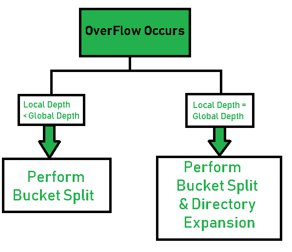

*   **步骤 8–重新刷新分割桶元素:**存在于被分割的溢出桶中的元素被重新刷新到目录的新的全局深度。
*   **步骤 9–**元素成功散列。

**<u>基于可扩展哈希的示例:</u>** 现在，让我们考虑一个对以下元素进行哈希的突出示例: **16，4，6，22，24，10，31，7，9，20，26。**
**桶大小:** 3(假设)
**哈希函数:**假设全局深度为 X，那么哈希函数返回 X 个 LSB。

*   **解法:**首先，计算每个给定数字的二进制形式。
    16-10000
    4-00100
    6-00110
    22-10110
    24-11000
    10-01010
    31-11111
    7-00111
    9-01001
    20-10100
    26-11010
*   最初，全局深度和局部深度总是 1。因此，哈希帧如下所示:

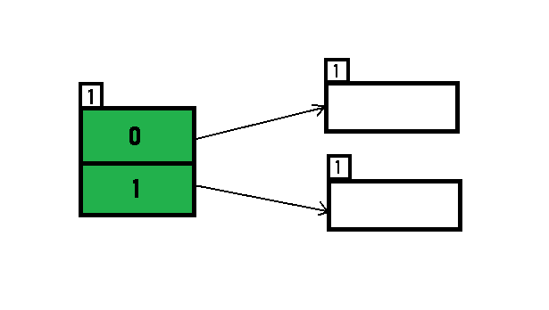

*   **插入 16:**
    16 的二进制格式是 10000，全局深度是 1。哈希函数返回 1000 **0** 的 1 个 LSB，即 0。因此，16 被映射到 id=0 的目录。

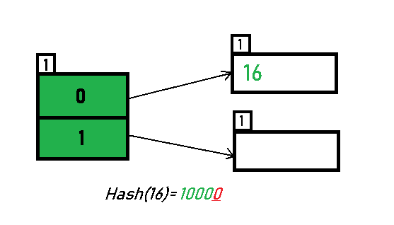

*   **插入 4 和 6:**
    4(10**0**)和 6(11 **0** )的 LSB 中都有 0。因此，它们被散列如下:

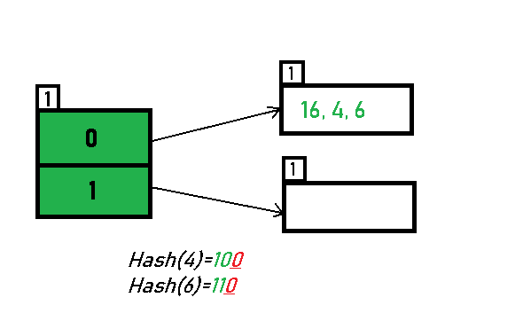

*   **插入 22:**22 的二进制形式为 1011 **0** 。它的 LSB 是 0。目录 0 指向的存储桶已满。因此，会发生溢出。

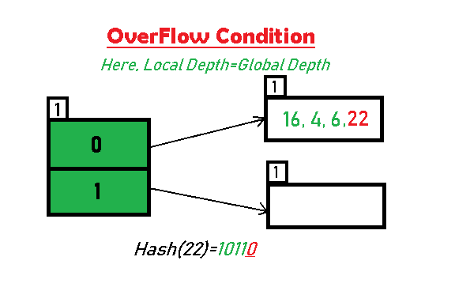

*   As directed by **Step 7-Case 1**, Since Local Depth = Global Depth, the bucket splits and directory expansion takes place. Also, rehashing of numbers present in the overflowing bucket takes place after the split. And, since the global depth is incremented by 1, now,the global depth is 2\. Hence, 16,4,6,22 are now rehashed w.r.t 2 LSBs.[ 16(100**00**),4(1**00**),6(1**10**),22(101**10**) ] 

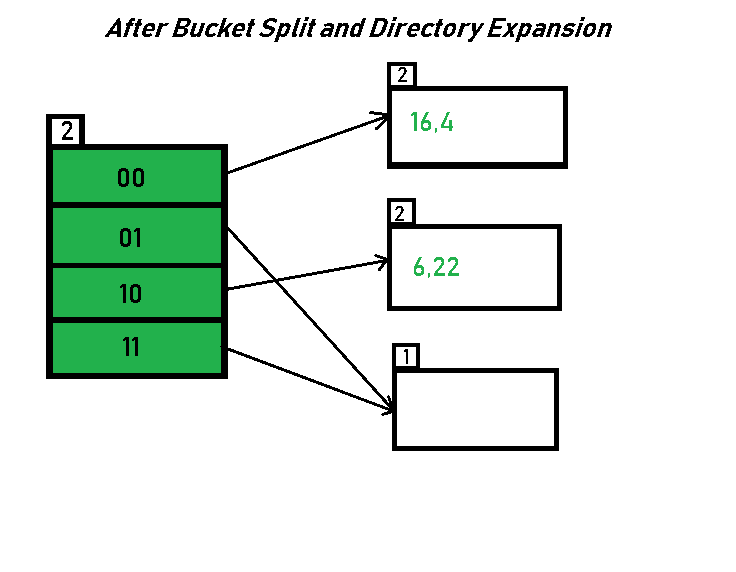

> *请注意，下溢的铲斗保持不变。但是，由于目录数量增加了一倍，我们现在有 2 个目录 01 和 11 指向同一个桶。这是因为铲斗的局部深度保持为 1。并且，任何局部深度小于全局深度的桶都被多个目录指向。

*   **插入 24 和 10:** 24(110 **00** )和 10 (10 **10** )可以基于 id 为 00 和 10 的目录进行散列。这里，我们没有遇到溢出条件。

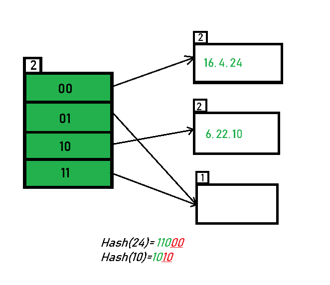

*   **插入 31，7，9:** 所有这些元素【31(111 **11** )、7(1 **11** )、9(10 **01** )】在其 LSB 中具有 01 或 11。因此，它们被映射到由 01 和 11 指出的桶上。我们在这里没有遇到任何溢出情况。

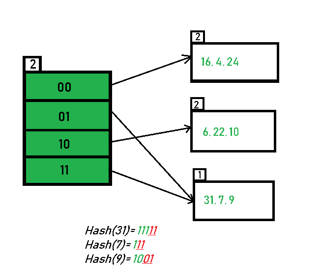

*   **插入 20:** 插入数据元素 20 (101 **00** )将再次导致溢出问题。

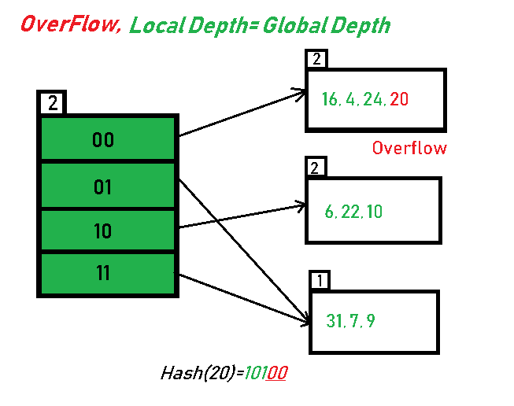

*   20 被插入由 00 指出的桶中。按照**步骤 7-情况 1** 的指示，由于桶的**局部深度=全局深度**，目录扩展(加倍)随着桶分裂而发生。溢出桶中存在的元素用新的全局深度重新混合。现在，新的哈希表如下所示:

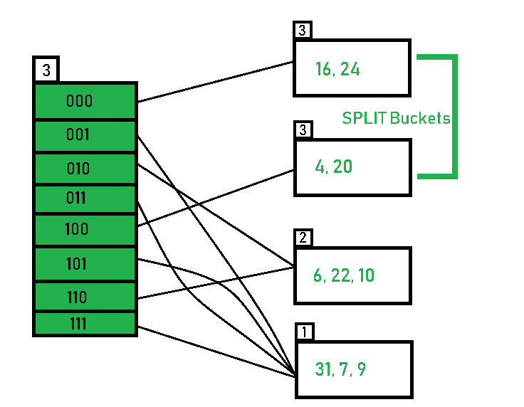

*   **插入 26:** 全局深度为 3。因此，考虑 26 的 3 个 LSB(11**010**)。因此，26 最适合目录 010 指出的桶。

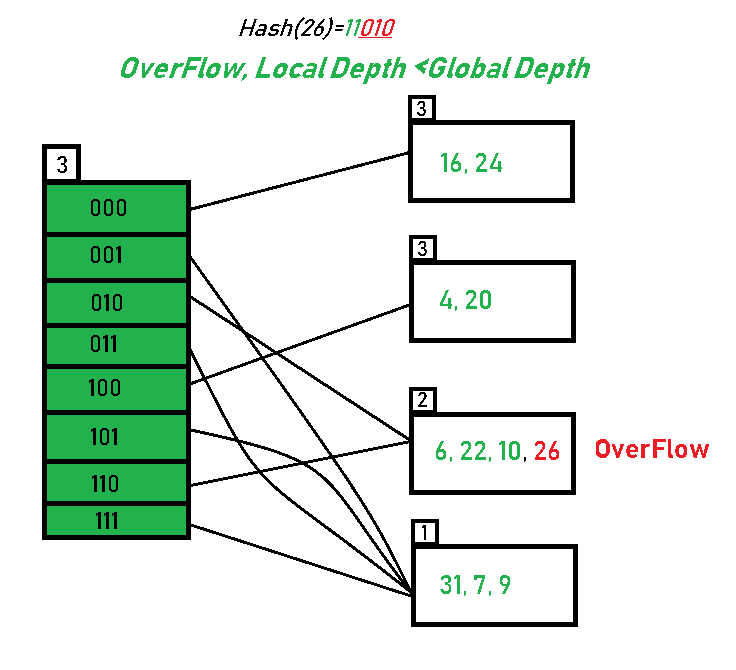

*   The bucket overflows, and, as directed by **Step 7-Case 2,** since the **local depth of bucket < Global depth (2<3)**, directories are not doubled but, only the bucket is split and elements are rehashed. 
    Finally, the output of hashing the given list of numbers is obtained. 

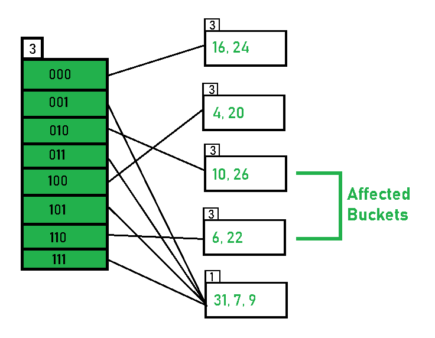

*   **11 个数字的散列就这样完成了。**

**<u>重点观察:</u>**

1.  如果一个桶的局部深度小于全局深度，它将有多个指针指向它。
2.  当桶中出现溢出情况时，桶中的所有条目将被重新刷新为新的局部深度。
3.  如果溢流桶的局部深度
4.  数据插入过程开始后，存储桶的大小不能更改。

**<u>优势:</u>**

1.  数据检索成本较低(就计算而言)。
2.  没有数据丢失的问题，因为存储容量会动态增加。
3.  随着散列函数的动态变化，相关的旧值被新的散列函数重新散列。

**<u>可扩展哈希的限制:</u>**

1.  如果在同一目录上对多个记录进行哈希运算，同时保持记录分布不均匀，则目录大小可能会显著增加。
2.  每个桶的大小都是固定的。
3.  当全局深度和局部深度差异变得剧烈时，内存会浪费在指针上。
4.  这种方法编码复杂。

**<u>用于实施的数据结构:</u>**

1.  [B+树](https://www.geeksforgeeks.org/data-structure-gq/b-and-b-trees-gq/)
2.  [阵列](https://www.geeksforgeeks.org/array-data-structure/)
3.  [链表](https://www.geeksforgeeks.org/data-structures/linked-list/)