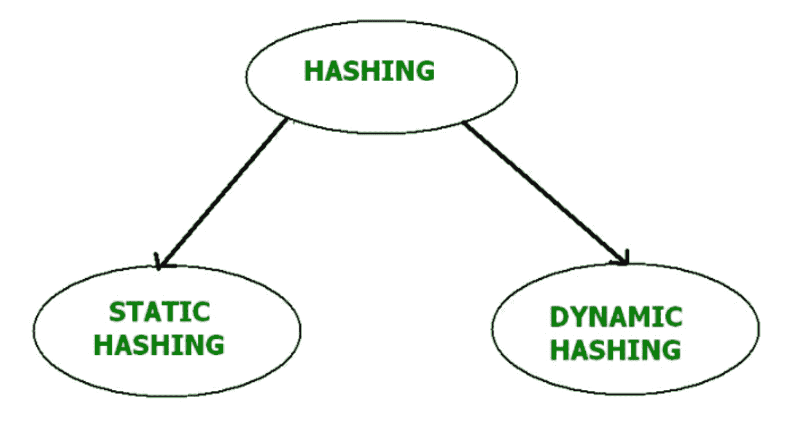

# 数据库管理系统中的文件组织|集合 2

> 原文:[https://www . geesforgeks . org/file-organization-in-DBMS-set-4/](https://www.geeksforgeeks.org/file-organization-in-dbms-set-4/)

先决条件–[散列数据结构](https://www.geeksforgeeks.org/hashing-data-structure/)
在数据库管理系统中，当我们想要检索特定的数据时，搜索所有的索引值并获得所需的数据会变得非常低效。在这种情况下，哈希技术应运而生。
**哈希**是一种不使用索引结构直接搜索磁盘上所需数据位置的有效技术。数据存储在数据块中，数据块的地址是通过使用哈希函数生成的。存储这些记录的存储位置称为数据块或数据桶。

### 哈希文件组织:

*   **数据桶–**数据桶是存储记录的内存位置。这些铲斗也被视为*存储单元*。
*   **哈希函数–**哈希函数是一个映射函数，它将所有搜索关键字集映射到实际的记录地址。通常，哈希函数使用主键来生成哈希索引——数据块的地址。哈希函数可以是简单的数学函数，也可以是任何复杂的数学函数。
*   **Hash Index-**The prefix of an entire hash value is taken as a hash index. Every hash index has a depth value to signify how many bits are used for computing a hash function. These bits can address 2n buckets. When all these bits are consumed ? then the depth value is increased linearly and twice the buckets are allocated.

    下图清楚地描述了散列函数的工作原理:

    

    哈希进一步分为两个子类别:

    

### 静态哈希–

在静态散列中，当提供搜索键值时，散列函数总是计算相同的地址。例如，如果我们想使用 mod (5)散列函数为 STUDENT_ID = 76 生成地址，它总是导致相同的桶地址 4。这里的桶地址不会有任何变化。因此，内存中用于静态散列的数据桶数量始终保持不变。

**操作–**

*   **插入–**当新记录被插入到表中时，散列函数 h 基于其散列关键字 K 为新记录生成桶地址。
    桶地址= h(K)
*   **搜索–**当需要搜索记录时，使用相同的哈希函数来检索该记录的桶地址。例如，如果我们想要检索 ID 76 的整个记录，并且如果该 ID 上的散列函数是 mod (5)，则生成的桶地址将是 4。然后我们将直接到达地址 4 并检索 ID 为 104 的整个记录。这里，标识充当哈希键。
*   **删除–**如果我们想要删除一条记录，我们将首先使用散列函数获取应该被删除的记录。然后我们将删除内存中该地址的记录。
*   **更新–**首先使用哈希函数搜索需要更新的数据记录，然后更新数据记录。

现在，如果我们想在文件中插入一些新记录，但是哈希函数生成的数据桶地址不是空的，或者数据已经存在于该地址中。这成为一个需要处理的关键情况。静态哈希中的这种情况称为**桶溢出**。
在这种情况下，我们将如何插入数据？
有几种方法可以克服这种情况。下面讨论一些常用的方法:

1.  **Open Hashing –**
    In Open hashing method, next available data block is used to enter the new record, instead of overwriting older one. This method is also called  linear probing.

    例如，D3 是需要插入的新记录，哈希函数将地址生成为 105。但是已经满了。因此，系统搜索下一个可用数据桶 123，并将 D3 分配给它。

    

2.  **Closed hashing –**
    In Closed hashing method, a new data bucket is allocated with same address and is linked it after the full data bucket. This method is also known as  overflow chaining.
    For example, we have to insert a new record D3 into the tables. The static hash function generates the data bucket address as 105\. But this bucket is full to store the new data. In this case is a new data bucket is added at the end of 105 data bucket and is linked to it. Then new record D3 is inserted into the new bucket.

    

    *   **二次探测:**
        二次探测非常类似于开放散列或线性探测。这里，新旧水桶的唯一区别是线性。二次函数用于确定新的桶地址。
    *   **双哈希:**
        双哈希是另一种类似于线性探测的方法。这里的差异是固定的，就像线性探测一样，但是这个固定的差异是通过使用另一个散列函数来计算的。这就是为什么这个名字是双重散列法。

### 动态哈希–

静态散列的缺点是，它不会随着数据库大小的增长或缩小而动态扩展或缩小。在动态散列中，数据存储桶随着记录的增加或减少而增长或缩小(动态添加或删除)。动态哈希也称为扩展哈希。

在动态散列中，散列函数用于产生大量的值。例如，有三个数据记录 D1、D2 和 D3。哈希函数分别生成三个地址 1001、0101 和 1010。这种存储方法只考虑该地址的一部分，尤其是只考虑存储数据的前一位。所以它试图在地址 0 和 1 加载其中的三个。

但问题是 D3 没有剩余的桶地址。铲斗必须动态增长以适应 D3。因此，它将地址更改为 2 位而不是 1 位，然后更新现有数据，使其具有 2 位地址。然后它试图容纳 D3。

**参考–
中的**