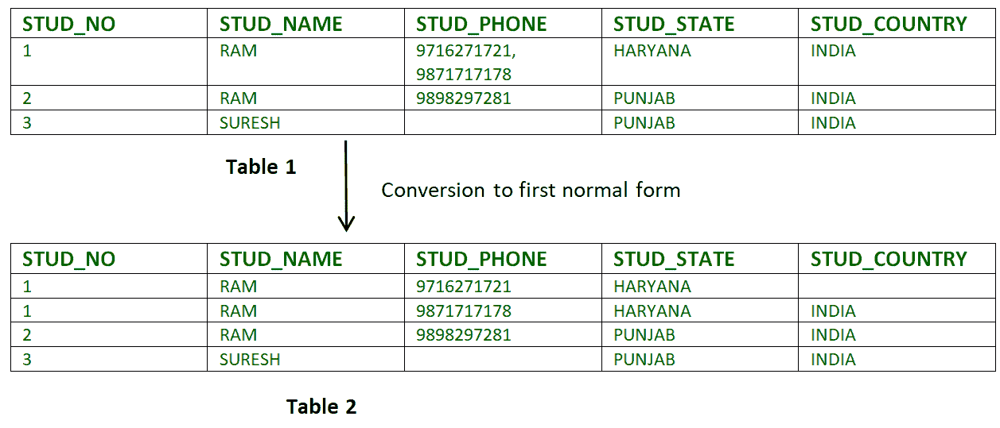

# 第一范式(1NF)

> 原文:[https://www.geeksforgeeks.org/first-normal-form-1nf/](https://www.geeksforgeeks.org/first-normal-form-1nf/)

如果一个表有数据冗余，并且没有适当地规范化，那么在不面临数据丢失的情况下，将很难处理和更新数据库。它还会消耗额外的内存空间，如果数据库没有正常化，插入、更新和删除*异常会非常频繁。*

[规范化](https://www.geeksforgeeks.org/database-normalization-normal-forms/)是从一个关系或一组关系中最小化冗余的过程。相关的冗余可能导致插入、删除和更新异常。所以，这有助于减少关系中的冗余。范式用于消除或减少数据库表中的冗余。

有各种程度标准化。以下是其中的一些:

```
1. First Normal Form (1NF)
2. Second Normal Form (2NF)
3. Third Normal Form (3NF) 
4. Boyce-Codd Normal Form (BCNF)
5. Forth Normal Form (4NF)
6. Fifth Normal Form (5NF) 
```

在本文中，我们将讨论第一范式(1NF)。

**第一范式(1NF):**
如果关系包含复合或多值属性，则违反第一范式，或者如果不包含任何**复合**或**多值属性**，则关系处于第一范式。如果一个关系中的每个属性都是单值属性，那么这个关系就是第一范式。

1 NF iff 中有一个表:

1.  只有单值属性。
2.  属性域不变。
3.  每个属性/列都有一个唯一的名称。
4.  数据的存储顺序并不重要。

考虑下面给出的例子。

**示例-1:**
表 1 中的 Relation STUDENT 不在 1NF 中，因为多值属性 STUD_PHONE。其分解成 1NF 的情况见表 2。



**示例-2:**

```
ID   Name   Courses
------------------
1    A      c1, c2
2    E      c3
3    M      C2, c3 
```

在上表中，课程是一个多值属性，因此它不在 1NF 中。

由于没有多值属性，下表为 1NF 格式:

```
ID   Name   Course
------------------
1    A       c1
1    A       c2
2    E       c3
3    M       c2
3    M       c3
```

**注意:**如果数据库设计甚至不在第一范式(1NF)中，则被认为是坏的。
https://youtu.be/-JOpBzyrZ_8