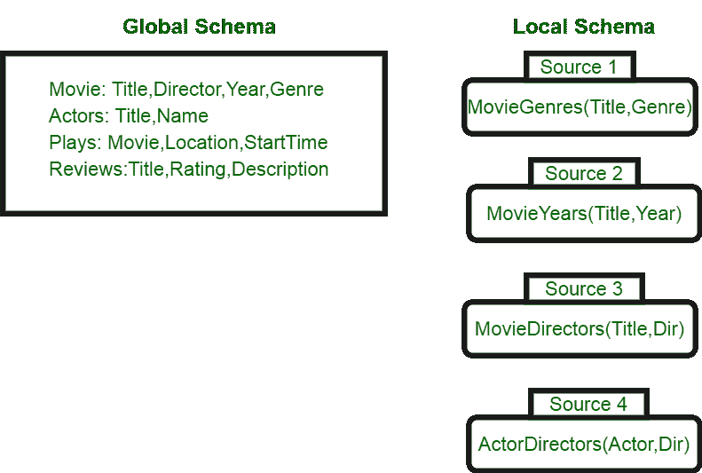

# 本地 as 视图(LAV)

> 原文:[https://www.geeksforgeeks.org/local-as-view-lav/](https://www.geeksforgeeks.org/local-as-view-lav/)

**本地 as View (LAV)** 是基于视图的数据集成系统(VDISs)用来执行数据集成的方法，即搜索和组合来自各种来源的数据。它将每个本地模式描述为全局模式之上的函数。在这里，数据源被定义为所提供模式的视图。模式的设计使得它即使在一些数据源加入或离开集成系统时也能保持稳定性。因此，LAV 允许在集成系统中独立于其他源增加或减少源。

**简史:**
LAV 映射的概念最初是由 Alon Y. Levy，Anand Rajaraman，Joann J. Ordille 提出的，目的是为了克服传统数据集成视图的缺点。LAV 映射的思想是局部模式的每个关系符号都是关于全局模式定义的。

早期的虚拟数据基础设施遵循全局视图(GAV)方法，其中全局模式是根据本地模式来描述的。由于全局模式是根据源来表达的，因此全局关系不能表示至少在单个源中不存在的任何信息。此外，基于免疫联盟的系统不允许独立于其他来源向系统添加来源。

因此，为了克服免疫球蛋白法的局限性，研究者们提出了免疫球蛋白法。

**应用:**

*   它用于实际的数据集成系统。
*   它用于恢复检查。

**它是如何工作的？**

通过描述全局数据库中哪些数据存在于源中，可以将 LAV 看作是源所有者对系统的看法。使用各种表达式按照全局模式描述本地模式，即源。Source 提供了从全局模式片段生成信息的表达式。在中介的帮助下，这些表达式被整理，以找到所有可能的方法来回答被激发的查询。

LAV 遵循双重方法，将局部关系定义为对全局关系的看法。目的是以这样一种方式描述全局模式，即当数据源加入或离开集成系统时，除了涉及变更的源的定义之外，各个定义不会改变。这个系统的质量是根据我们对资源的描述来衡量的。

在 LAV 中，局部到全局的对应关系可以表示为一组映射:


其中 R <sub>i</sub> 是局部模式的任意关系，U <sub>i</sub> 是全局模式的查询，I 是返回 R <sub>i</sub> 所有属性的查询。

下面的例子可以说明这一点:



在这里，

```
MovieGenres(Title, Genre) ⊆ Movie(Title, Dir, Year, Genre) 
MovieDirectors(Title, Dir) ⊆ Movie(Title, Dir, Year, Genre)
MovieYears(Title, Year) ⊆ Movie(Title, Dir, Year, Genre)
ActorDirectors(Actor, Dir) ⊆ Movie(Title, Dir, Year, Genre), 
                              Actors(Title, Name) 
```

遵循 LAV 方法的数据集成系统示例:

*   **信息流形–**
    信息流形是用于浏览和查询众多网络信息源的系统。
*   **DWQ–**
    DWQ 集成架构遵循 LAV 方法，并根据全局模式定义数据仓库表和源表。它在概念层面使用丰富的建模语言，扩展了实体关系数据模型。因此，它变得与各种概念建模工具完全兼容。
*   **皮塞尔–**
    皮塞尔是建立在分散且可能异构的资源上的信息集成系统。

**优势:**

*   各种源可以相互独立地注册，因为源的映射不引用系统中的其他源。
*   当参与数据源频繁变更时，局部和全局关系之间存在松散耦合，增强了数据集成系统的灵活性和健壮性。
*   LAV 映射能够非常详细地描述数据源的内容。

**缺点:**

*   无法对全局架构中不存在信息的源进行建模。因此，LAV 系统必须经常处理部分答案。
*   现有的 LAV 查询重写器只管理 NP 完全的连接查询。
*   LAV 系统的声明性使得查询回答成为一项非常重要的工作。因此，为了获得针对全局模式的触发查询的答案，必须将其转换为针对本地模式的相应查询。这种问题被称为使用视图重写查询。
*   采用 LAV 方法的数据集成系统比采用 GAV 方法的系统相对更复杂。