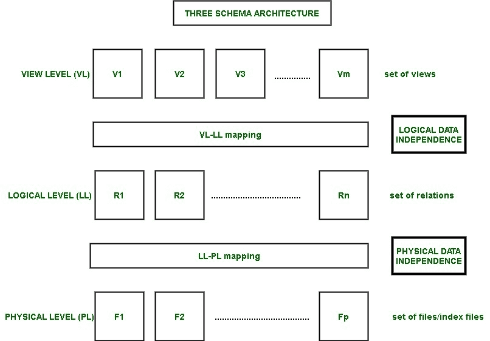

# 物理和逻辑数据独立性

> 原文:[https://www . geeksforgeeks . org/物理和逻辑数据独立性/](https://www.geeksforgeeks.org/physical-and-logical-data-independence/)

### **1。物理数据独立性:**

物理数据独立性被定义为能够在不影响更高级模式的情况下，对数据库管理系统(DBMS)的最底层结构进行更改。因此，物理级别的修改不应导致逻辑或视图级别的任何变化。

**注–**
DBMS 的模式架构有 3 个层次:物理层、逻辑层、视图层(从最低到最高排列)。

**示例–**
最底层(物理层)的变化有:新建文件、将新文件存储在系统中、新建索引等。

举例说明为什么我们可能希望在物理级别上进行任何类型的数据修改——我们可能希望在物理级别上更改或变更数据。这是因为我们可能希望添加或删除文件和索引，以提高数据库系统的性能并使其更快。因此，通过这种方式，物理数据独立性使我们能够进行性能调整。理想情况下，当我们改变物理级别时，我们不想改变逻辑和视图级别。

### **物理数据独立性是如何实现的？**

物理数据独立性是通过修改物理层到逻辑层的映射(PL-LL 映射)来实现的。我们必须确保我们所做的修改是本地化的。

### **逻辑数据独立性**

逻辑数据独立性被定义为在不影响最高级别模式或应用程序的情况下，对数据库管理系统(DBMS)的中间层结构进行更改的能力。因此，逻辑级别的修改不应导致视图级别或应用程序的任何变化。

**示例–**
中间层(逻辑层)的变化有:给关系增加新的属性，删除关系已有的属性等。理想情况下，我们不希望更改任何不需要使用修改属性的应用程序或程序。

### **逻辑数据独立性是如何实现的？**

逻辑数据独立性通过修改视图层到逻辑层的映射(VL-LL 映射)来实现。