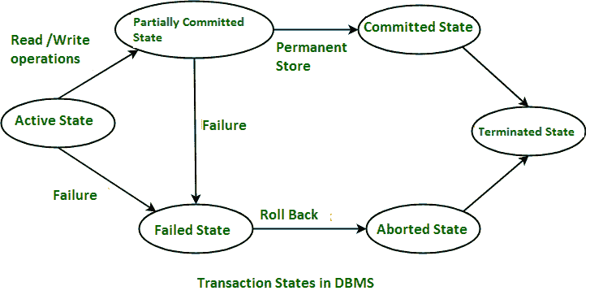

# 数据库管理系统中的事务状态

> 原文:[https://www.geeksforgeeks.org/transaction-states-in-dbms/](https://www.geeksforgeeks.org/transaction-states-in-dbms/)

事务在其生命周期中经历的状态。这些状态说明了事务的当前状态，也说明了我们将如何进一步处理事务。这些状态控制着决定事务命运的规则，无论是提交还是中止。

这些是不同类型的事务状态:

1.  **活动状态–**
    当事务的指令正在运行时，则事务处于活动状态。如果所有的“读和写”操作都没有任何错误地执行，那么它就进入“部分提交状态”；如果任何指令失败，它将进入“失败状态”。

2.  **部分提交–**
    完成所有读写操作后，更改将在主内存或本地缓冲区中进行。如果更改在数据库中永久存在，则状态将更改为“已提交状态”，如果失败，将转到“失败状态”。

3.  **失败状态–**
    当事务的任何指令失败时，它将进入“失败状态”，或者如果在对数据库上的数据进行永久更改时出现故障，则进入“失败状态”。

4.  **中止状态–**
    发生任何类型的故障后，事务从“失败状态”变为“中止状态”，因为在以前的状态下，更改只对本地缓冲区或主内存进行，因此这些更改会被删除或回滚。

5.  **提交状态–**
    这是在数据库上永久进行更改并且事务完成并因此在“终止状态”下终止的状态。

6.  **终止状态–**
    如果没有回滚或者事务来自“已提交”状态，那么系统是一致的，并准备好新事务，旧事务被终止。