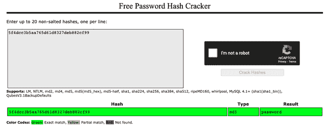

# 哈希和哈希冲突的密码介绍

> 原文:[https://www . geesforgeks . org/a-密码学-哈希和哈希冲突介绍/](https://www.geeksforgeeks.org/a-cryptographic-introduction-to-hashing-and-hash-collisions/)

**什么是哈希？**
哈希是将任何类型的数据(通常是密码或安装程序文件)转换成固定长度字符串的过程。哈希有多种类型，但在本文中，我们将只关注 MD5 哈希。MD5 是哈希方法的一个例子。例如，“hello”(不带引号)的 MD5 哈希是“5d 41402 ab C4 b2a 76 b 9719d 911017 c 592”(不带引号)。同样，“极客对极客”的 MD5 哈希(不带引号)是“5ee 878924 e0cb 782 e 0729066 a7 d 88832”(不带引号)。你会注意到，尽管“极客对极客”比“你好”更长，但他们的 MD5 哈希都是相同长度的。这就是哈希易受攻击的原因，也是我们将在本文后面讨论的内容。

**我们为什么要用哈希？**
哈希通常有一些通用用例–

1.  密码安全
2.  确保正确下载
3.  图像完整性验证

在本文中，我们将从密码安全的角度来看哈希，因为这是它最常见的用例。

**密码安全:**
很多时候，一个网站需要有一个登录表单来认证其用户。通常，这些网站有很多不同的用户，需要将他们的登录信息存储在某种数据库中。然而，在数据库中以明文形式存储密码是极其不安全的。

**例如**，假设一名黑客设法进入了存储在网站上的以下登录信息数据库–

<figure class="table">

| **用户名** | **密码** |
| 管理 | Admin_securep@$w0rd |
| johnnyapprenseed 123 | ja.5923！ |
| 达吉本 | 第 151982 号 |

从这个表中，每个用户的密码变得显而易见。此外，黑客刚刚获得了管理员帐户的访问权限，现在可以控制网站的几个方面！相反，该网站决定使用其 MD5 哈希来存储密码。探索这个场景，假设黑客设法进入了网站的新数据库。这就是他们看到的–

<figure class="table">

| **用户名** | **密码哈希** |
| 管理 | 865 c 5895 f 347413 ca 07 c 81 E6 c 365 CB 31 |
| johnnyapprenseed 123 | a 55805 EC 1 caef 94681 bb 0727659 c 887 |
| 达吉本 | ae 93717757 ecfb 103847 b 6752 b 88 和 36 |

现在，黑客只能看到密码的哈希，*理论上*无法登录这些账户。没有实际的密码，散列对黑客来说(同样，理论上)是无用的。但是现在，网站将如何认证其用户？该网站将检查用户输入的密码的散列，而不是对照数据库检查用户输入的密码。如果该哈希与数据库中的哈希匹配，则用户通过身份验证！这是因为“Admin_securep@$w0rd”的 MD5 哈希将始终为“865 c 5895 f 347413 ca 07 c 81 E6 c 365 CB 31”(像 BCrypt 这样的更安全的哈希使用更复杂的哈希方法以及比较两个哈希的更复杂方法，但是为了简单起见，我们现在将继续使用 MD5)，尽管您始终可以从密码转到哈希，但从哈希转回到密码(理论上)是非常困难的。
刚才“理论上”这个词被广泛使用，原因如下。

**哈希破解:**
哈希破解需要获取一个大的单词列表或字典，并对每个单词进行哈希运算。然后，对照你试图破解的散列值，检查字典中每个单词的散列值。一旦你找到了匹配，你就找到了你的话！这就是为什么不建议使用常用词作为密码的原因。
参考上面的例子，黑客获得了对网站登录数据库的访问，这是数据库中的一行–

<figure class="table">

| **用户名** | **密码哈希** |
| 法尔乐 157 | 5f 4 DCC 3b 5aa 765d 61d 8327 deb 882 cf 99 |

因为黑客不会因为密码被散列而放弃，他们会通过散列破解程序(检查非常常用的散列)运行这个散列，就像[这个](https://crackstation.net/)。只需键入哈希“5f 4 dcc3b 5a a 765 d61d 8327 deb 882 cf 99”，求解 reCaptcha 并获得结果–

crackstation.net 破解了一个普通的 MD5 散列

现在，黑客知道 pharrell157 的密码只是使用免费在线工具几秒钟内的“密码”。
这是 MD5 哈希不安全的主要原因之一。因为它是一个未加密的散列(不同于 BCrypt)，所以每次相同的数据都会产生相同的散列。也就是说，“password”的 MD5 哈希将始终为“5f 4 dcc3b 5a a 765 d61d 8327 deb 882 cf 99”。
除了哈希破解(每个哈希都容易受到这种攻击)之外，MD5 不安全还有一个更大的原因。

**哈希碰撞:**
世界上有无限多种任意位数的可能组合。因此，有无限多可能的数据可以被散列。注意散列的定义，上面说散列总是固定长度的。例如，MD5 哈希总是 128 位长(通常表示为 16 个十六进制字节)。因此，存在 2^128 可能的 MD5 散列。虽然这是一个非常大的数字，但它肯定是有限的……尽管可以散列的可能密码的数量是无限的。这意味着无限多不同的密码具有相同的哈希。这也意味着，如果黑客获得了对密码的 MD5 散列的访问权，他们不一定需要找到实际的密码，而是需要找到共享该散列的其他东西。由于最近的技术创新，在 MD5 哈希中查找冲突几乎是微不足道的。有关更多信息，请参见马克·史蒂文斯的项目、[hashcash](https://github.com/cr-marcstevens/hashclash)，或科克阿米的[GitHub repo on conflicts](https://github.com/corkami/collisions)。

**我们可以用什么代替 MD5？**
谢天谢地，现在 MD5 没有提供我们可能希望的相同级别的安全性，已经创建了许多新的哈希，它们可以。例如，SHA-256(又名 SHA-2)更安全，因为它的长度是 256 位，而不是 128 位。现在，大多数网站都使用像 BCrypt 这样的加盐散列，只要有不同的盐(或种子)，它就可以从同一个密码创建不同的散列。在某些情况下，MD5 哈希可能仍会用于数字取证，但它大多已被这些更安全的替代方案所取代。

</figure>

</figure>

</figure>