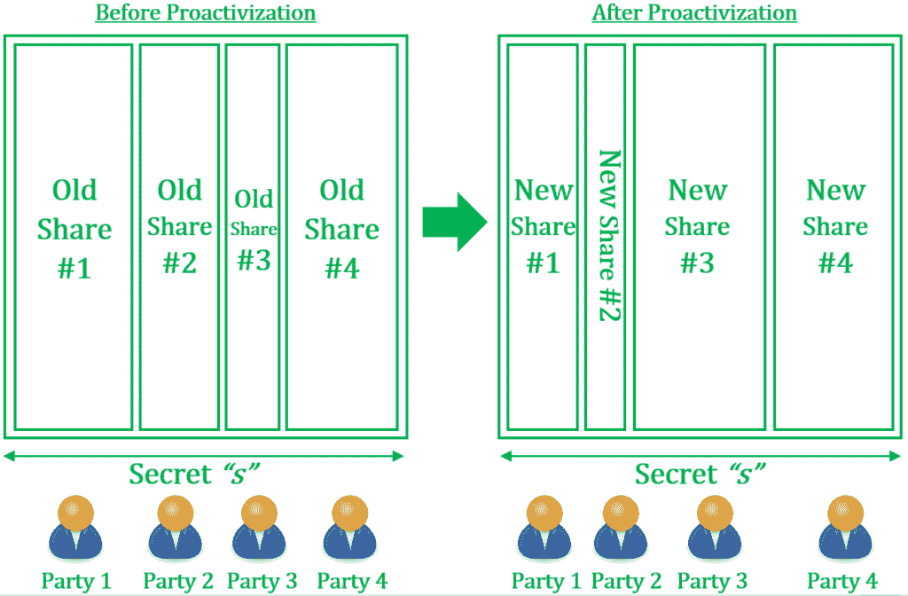

# 附加秘密共享和共享主动化——使用 Python

> 原文:[https://www . geesforgeks . org/additive-secret-share-and-share-proactivization-use-python/](https://www.geeksforgeeks.org/additive-secret-sharing-and-share-proactivization-using-python/)

一个**秘密共享方案**是一个密码方案，它涉及将一个秘密值分解成多个**片段/份额**，防止单个股东完全知道原始秘密。因此，秘密被分成多个份额，并在多个参与者之间分发。因此，对秘密值的控制是分布式的，而不是由一方持有。
秘密共享方案最简单的例子是**附加秘密共享**，它涉及将一个数字秘密分解成碎片，这些碎片加起来就是原始秘密。一旦分成股份，每份股份就分配给不同的参与者。没有一个参与者有足够的信息来重建秘密。为了重建秘密，所有参与者必须将他们的股份集中在一起，以揭示原始的秘密价值。

[](https://media.geeksforgeeks.org/wp-content/uploads/20200517223104/82B95E52-C8A5-4F6B-A712-95B526A3E9AF.png)

**图 1:** 使用加法共享在三方之间划分秘密

**例**
假设存在以下条件:

*   我们要划分的秘密由值 *s = 12345* 给出
*   系统参与人数为 *n = 3* 。因此，我们需要获得三份股份，每一方一份
*   当所有各方汇集并合并他们的股份时，秘密就暴露了

秘密的一个任意划分可能是:。因此，第一方得到价值 3512 的份额，第二方得到 2100，第三方得到 6733。显然，除非三方都将股份集中在一起，否则秘密无法泄露。这样的方案被称为 *** n 对 n 共享方案*** ，因为秘密重建需要所有股份。

### 有限域上的加法共享

传统上，秘密值和共享值被绑定到一个有限域，在该域中进行所有计算。在这样的方案中，除了最后一部分，所有的股票都是随机挑选的，确保它们属于所选的有限域。假设 *n* 股份总数中 *(n-1)* 为 *S(1)、S(2)、…、S(n-1)* 。最终份额计算为*S(n)= V –( S(1)+S(2)+…+S(n-1))*，其中 *V* 为原始秘密的价值。
概括一下，我们选取(n-1)个随机份额，计算最终份额。

## 蟒蛇 3

```
import random

def getAdditiveShares(secret, N, fieldSize):
    '''Generate N additive shares from 'secret' in finite field of size 'fieldSize'.'''

    # Generate n-1 shares randomly
    shares = [random.randrange(fieldSize) for i in range(N-1)]

    # Append final share by subtracting all shares from secret
    # Modulo is done with fieldSize to ensure share is within finite field
    shares.append((secret - sum(shares)) % fieldSize )
    return shares

def reconstructSecret(shares, fieldSize):
    '''Regenerate secret from additive shares'''
    return sum(shares) % fieldSize

if __name__ == "__main__":
    # Generating the shares
    shares = getAdditiveShares(1234, 5, 10**5)
    print('Shares are:', shares)

    # Reconstructing the secret from shares
    print('Reconstructed secret:', reconstructSecret(shares, 10**5))
```

**Output:** 

```
Shares are: [488, 62586, 9652, 49515, 78993]
Reconstructed secret: 1234
```

### 添加剂份额的积极化

主动化是指在固定的时间间隔后刷新共享，以降低攻击者访问秘密的可能性。假设攻击者可以在某个合理的时间内获得任何参与者持有的股份。然而，单一份额的妥协并没有揭示全部秘密。因此，攻击者将不得不牺牲所有生成的共享来获得对实际秘密的访问。这就是主动化发挥作用的地方。使用主动化，**所有共享在固定时间间隔**后被任意刷新，这样攻击者可能永远无法访问所有最新的共享。因此，如果份额以这样的速率被刷新，使得对手在任何给定点只能访问所有份额的一个子集，则该方案受到保护而不会受到损害。
主动化的目标是保持相同的关键价值，但不改变其份额。每个生命周期后都会生成一组新的附加份额，如下所示:

1.  每个加法份额 S(i)被细分为*子片段* **d(i，1)，d(i，2)……，d(i，n)** 这样所有 **d(i，j)** 的总和产生 **S(i)** 和 ***n*** 是系统中的参与者数量

2.  子片段 **d(i，j)** 由所属方***I***分配给所属方***j***。以这种方式，所有参与者交换他们的亚片段。
3.  为了计算其刷新份额，方**将其从所有其他参与者接收的子片段添加如下:**

**仔细观察，我们看到**每个股东本质上都是对自己的股份**进行加法分享，并将产生的子股份分配给参与者。随后，每个参与者将收到的子股份相加。这样，在刷新参与者所持股份的同时，原始秘密得以保留。** 

**[](https://media.geeksforgeeks.org/wp-content/uploads/20200517231407/C0A593EF-8810-443B-8E63-461F66F96D2F.png)

**图 02:** 在主动化中，在不改变秘密本身的情况下刷新附加份额** 

## **蟒蛇 3**

```
# Additive Sharing with facility to Refresh shares via Proactivization
import random

def getAdditiveShares(secret, N, fieldSize):
    '''Generate N additive shares from 'secret' in finite field of size 'fieldSize'.'''

    # Generate n-1 shares randomly
    shares = [random.randrange(fieldSize) for i in range(N-1)]
    # Append final share by subtracting all shares from secret
    shares.append((secret - sum(shares)) % fieldSize )
    return shares

def reconstructSecret(shares, fieldSize):
    '''Regenerate secret from additive shares'''
    return sum(shares) % fieldSize

def proactivizeShares(shares):
    '''Refreshed shares by proactivization'''

    n = len(shares)
    refreshedShares = [0]*n

    for s in shares:

        # Divide each share into sub-fragments using additive sharing
        subShares = getAdditiveShares(s, n, 10**5)

        # Add subfragments of corresponding parties
        for p, sub in enumerate(subShares):
            refreshedShares[p] += sub

    return refreshedShares

if __name__ == "__main__":
    # Generating the shares
    shares = getAdditiveShares(1234, 5, 10**5)
    print('Shares are:', shares)

    # Running Proactivization
    newShares = proactivizeShares(shares)
    print('Refreshed Shares are:', newShares)

    # Reconstructing secret from refreshed shares
    print('Secret:', reconstructSecret(newShares, 10**5))
```

****Output:** 

```
Shares are: [45142, 41833, 39277, 49009, 25973]
Refreshed Shares are: [298371, 255404, 117787, 239851, 189821]
Secret: 1234
```**