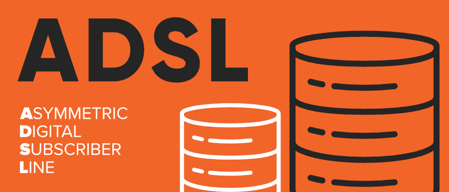

# ADSL 全格式

> 原文:[https://www.geeksforgeeks.org/adsl-full-form/](https://www.geeksforgeeks.org/adsl-full-form/)

**ADSL** 代表**非对称数字用户线路**，是一种常见的 DSL 通信技术，旨在提供比传统拨号连接更快的速度和更大的带宽。与传统的调制解调器线路相比，ADSL 允许在用于固定电话的现有铜质电话线上进行更快的传输和更多的数据发送。ADSL 中的“不对称”一词指的是它使用大部分容量向下游向客户传输信号，以提供更快的下载速度。

#### 历史

20 世纪 80 年代，贝尔科开发了一种称为 HDSL(高比特率 DSL)的 DSL 变体，它在两个方向上提供等量的宽带数字传输，即下载和上传的带宽相同。它有一个缺点，因为它需要多条电话线来完成这项工作。20 世纪 80 年代末，约瑟夫·莱赫雷德(Joseph Lechleide)证明了发送宽带信号的不对称性如何有助于更好的下载速度和更高的带宽，他提出可以向一个方向发送更高速率的数据。这是从模拟到数字的转变。最初开发时部署成本很高，直到 20 世纪 90 年代末才推出供公众使用。它在 2000 年代开始流行，现在几乎所有的技术都升级到支持 ADSL

#### ADSL 的特点

*   ADSL 使用一根铜质电话线同时提供数据传输和语音传输。
*   ADSL 需要安装一个调制解调器，允许线路本身之间的数据通信。
*   ADSL 连接由三条独立的传输线组成:
    1.  **数据传输通道**用于将用户信息发送到互联网(上传)。
    2.  **数据接收通道**用于从互联网接收信息(下载)。它是三个通道中最宽的。
    3.  **常规电话服务通道**用于传输电话呼叫。
*   不同运营商之间的数据传输速度差异很大。
*   ADSL 是宽带连接技术，最高可达 6Mbps 的速度，但只能接收 2Mbps 的下载和 512Kbps 的上传速度

#### 优势

*   ADSL 提供了更大的带宽。
*   ADSL 总是“开着”的，不需要每次都拨号，节省了时间。
*   ADSL 提供的速度比拨号连接快 30 到 40 倍。
*   语音质量和浏览速度不受使用同一条电话线传输的影响。
*   ADSL 使用现有的基础设施，从而降低了安装成本，并使其易于安装。

#### 不足之处

*   速度取决于您的家(或办公室)和互联网服务提供商办公室之间的距离，这有时会导致接收速率大大低于提供的速率。
*   上传速度较慢。
*   ADSL 易受干扰。
*   ADSL 受同一地区同时使用同一条线路的用户数量的影响。