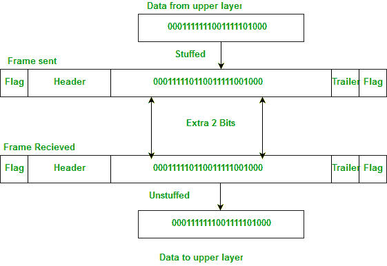

# 计算机网络中的比特填充

> 原文:[https://www . geesforgeks . org/bit-in-filling-in-computer-network/](https://www.geeksforgeeks.org/bit-stuffing-in-computer-network/)

数据链路层负责所谓的成帧，它是将网络层的比特流分成可管理的单元(称为帧)。框架可以是固定大小或可变大小的。在可变尺寸框架中，我们需要一种方法来定义框架的结束和下一个框架的开始。

**位填充**是将非信息位插入数据。请注意，填充位不应与开销位混淆。**开销位**是传输所必需的非数据位(通常作为报头、校验和等的一部分)。).

**钻头填料的应用–**

1.  多路复用前同步几个通道
2.  将两个单通道彼此进行速率匹配
3.  游程长度受限编码

**游程长度受限编码–**限制待传输数据中相同值(即二进制值)的连续位数。在允许的最大连续位数后插入一个相反值的位。

比特填充技术不能确保发送的数据在接收端是完整的(即没有被传输错误破坏)。这只是确保传输在正确的地方开始和结束的一种方式。

**比特填充的缺点–**
码率不可预测；这取决于传输的数据。

**位填充示例–**
位序列:1101011111010111111011111110(无位填充)
位序列:1101011111**0**01011111**0**101011111**0**110(有位填充)

连续 5 个 1 位后，填充一个 0 位。填充位标有粗体。

字节填充和位填充的区别参见