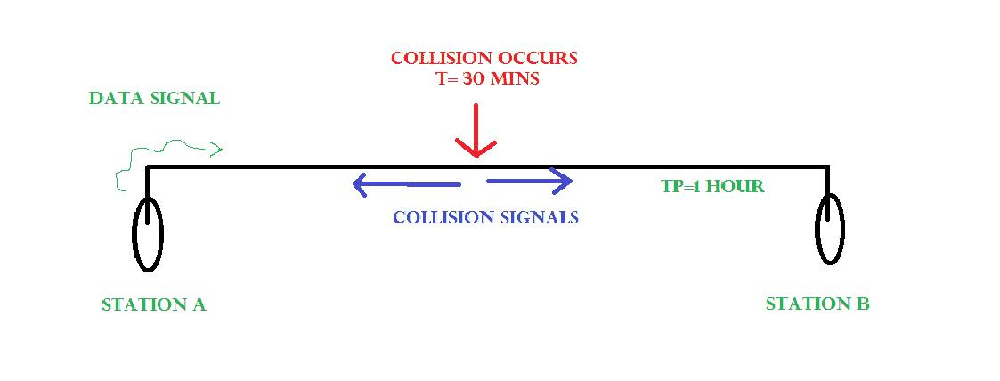
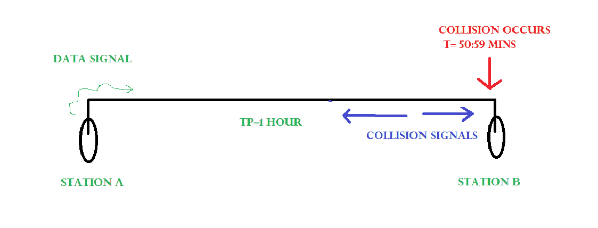

# CSMA/光盘碰撞检测

> 原文:[https://www.geeksforgeeks.org/collision-detection-csmacd/](https://www.geeksforgeeks.org/collision-detection-csmacd/)

CSMA/光盘(载波侦听多路访问/冲突检测)是早期以太网技术/局域网中广泛使用的一种媒体访问控制方法，当时有共享的
总线拓扑，每个节点(计算机)通过同轴电缆连接。现在，一天以太网是全双工的，没有使用 Star 光盘，因为拓扑是星形(通过交换机或路由器连接)
或点对点(直接连接)，但它们仍然受到支持。

假设链路上有“n”个站点，所有站点都在等待通过该通道传输数据。在这种情况下，所有“n”个站都希望接入链路/信道来传输它们自己的数据。当多个站同时传输数据时，问题就出现了。在这种情况下，来自不同站点的数据会有冲突。

CSMA/光盘就是这样一种技术，遵循该协议的不同站点就有效传输的一些条款和冲突检测措施达成一致。该协议决定了哪个站将在何时传输，以便数据到达目的地时不会损坏。

**CSMA/CD 是如何工作的？**

*   **步骤 1:** 检查发送方是否准备好发送数据包。
*   **步骤 2:** 检查传输链路是否空闲？
    发送方必须继续检查传输链路/介质是否空闲。为此，它会持续检测来自其他节点的传输。发送方在链路上发送虚拟数据。如果它没有接收到任何冲突信号，这意味着链路此刻是空闲的。如果它感觉到载波是自由的，没有冲突，它就发送数据。否则，它不会发送数据。
*   **步骤 3:** 传输数据&检查碰撞。
    发送方在链路上传输数据。CSMA/裁谈会不使用“承认”制度。它通过碰撞信号检查成功和不成功的传输。在传输期间，如果节点接收到冲突信号，则传输停止。然后，基站在链路上发送干扰信号，并在重新发送帧之前等待随机时间间隔。经过一段随机时间后，它再次尝试传输数据，并重复上述过程。
*   **步骤 4:** 如果在传播过程中未检测到冲突，发送方将完成其帧传输并重置计数器。

**一个站如何知道自己的数据是否冲突？**



考虑以上情况。两个站，A & B.
传播时间:Tp = 1 小时(信号从 A 到 B 需要 1 小时)

```
At time t=0, A transmits its data.
        t= 30 mins : Collision occurs.
```

碰撞发生后，会产生一个碰撞信号，并发送到两个 A & B 站，通知站点发生了碰撞。由于碰撞发生在中途，碰撞信号也需要 30 分钟才能到达 A & B。

```
Therefore, t=1 hr: A & B receive collision signals.
```

这条链路上的所有站点都接收到这个冲突信号。然后，

**如何保证碰撞的是我站的数据？**
为此，传输时间(Tt) >传播时间(Tp)【粗略界限】
这是因为，我们希望在从我们的站传输数据的最后一位之前，我们至少应该确定一些位已经到达它们的目的地。这可确保链路不繁忙，不会发生冲突。
但是，上面是一个松散的束缚。我们没有利用碰撞信号所花费的时间回到我们身边。为此，请考虑最坏的情况。

再考虑一下上面的系统。



```
At time t=0, A transmits its data.
        t= 59:59 mins : Collision occurs
```

这种冲突就发生在数据到达 b 之前。现在，冲突信号需要 59:59 分钟才能再次到达 A。因此，A 大约在 2 小时后，即 2 * Tp 后收到冲突信息。

```
Hence, to ensure tighter bound, to detect the collision completely,
  Tt > >= 2 * Tp  
```

这是系统检测冲突是否属于其自身数据所能花费的最大冲突时间。

**要传输的数据包的最小长度应该是多少？**
传输时间= Tt =数据包长度/链路带宽
【发送方每秒传输的位数】
代入上面，我们得到，
数据包长度/链路带宽> = 2 * Tp

```
Length of the packet >= 2 * Tp * Bandwidth of the link
```

在我们没有如此长的数据包的情况下，填充会有所帮助。我们可以在数据的末尾填充额外的字符来满足上述条件。

接下来阅读–[CSMA/光盘的效率](https://www.geeksforgeeks.org/computer-network-efficiency-csmacd/)T2】