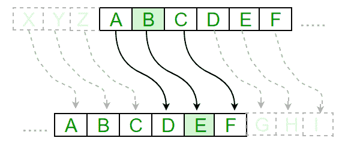

# 密码学的发展

> 原文:[https://www.geeksforgeeks.org/development-of-cryptography/](https://www.geeksforgeeks.org/development-of-cryptography/)

**古典密码学–**
已知的最早使用[密码学的地方](https://www.geeksforgeeks.org/computer-network-cryptography-introduction/)可以追溯到公元前 1900 年的旧埃及王国时期，以非标准象形文字的形式出现。象形文字是埃及人用来相互交流的一种秘密交流方式。这个秘密的文本只有那些曾经代表他们传递信息的国王的抄写员知道。

古希腊人以使用密码而闻名。凯撒密码或移位密码是最早和最简单的众所周知的密码技术之一。它是替换密码的一种形式，其中一个单词中的每个字符都被固定数量的位置替换。比如移位 3，A 被 D 代替，B 被 E 代替，以此类推。

**第一次和第二次世界大战期间–**
密码学在一战和二战期间盟军的胜利中发挥了至关重要的作用。第二次世界大战突出地看到了机电密码机的使用。盟军通过破解世界著名的恩尼格玛机战胜德军的故事众所周知。像所有转子机器一样，英格玛是机电子系统的组合。它由三到五个转子组成。只要按下一个键，主轴上的一个或多个转子就会旋转，因此该键被*置乱*到其他位置。

**[【数据加密标准(DES)】](https://www.geeksforgeeks.org/computer-network-data-encryption-standard-des-set-1/)—**
20 世纪 70 年代初，数据加密标准或 DES 应运而生。它是基于*费斯特密码*的对称密钥算法，用于电子数据的加密。它的密钥大小相对较小，为 56 位，一次加密 64 位或 8 个字符。但是，它后来被停止，因为它被发现是不安全的，特别是对蛮力攻击，因为它的密钥大小相对较小。

**[高级加密标准(AES)](https://www.geeksforgeeks.org/difference-between-aes-and-des-ciphers/)–**
DES 在 2001 年被高级加密标准或 AES 所取代。与 DES 不同，AES 基于*置换-置换网络*。AES 是 Rijndael 的子集。它是一个具有不同密钥和分组大小的密码家族。在 AES 的情况下，块大小为 128 位或 16 个字符，这意味着一次可以加密 16 个字符。它有三种不同的密钥大小:128 位、192 位和 256 位。