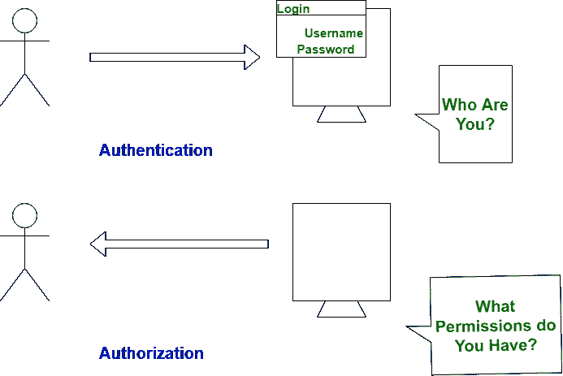

# 认证和授权的区别

> 原文:[https://www . geesforgeks . org/身份验证和授权的区别/](https://www.geeksforgeeks.org/difference-between-authentication-and-authorization/)

[认证和授权](https://www.geeksforgeeks.org/computer-network-aaa-authentication-authorization-and-accounting/)两个区域单元都在知识安全方面得到了利用，从而保证了自动数据系统的安全性。每个区域单元都有非常关键的主题，这些主题通常与作为其服务基础设施关键项目的在线相关。然而，每个术语的面积单位完全不同，概念也完全不同。诚然，它们通常在同等的环境中使用同等的工具，但它们完全不同。

在[认证过程](https://practice.geeksforgeeks.org/problems/explain-authentication-and-authorization)中，检查用户的身份以提供对系统的访问。在授权过程中，会检查个人或用户访问资源的权限。认证在授权过程之前完成，而授权过程在认证过程之后完成。

让我们看看身份验证和授权之间的区别:

| S.NO | 证明 | 批准 |
| --- | --- | --- |
| 1. | 在认证过程中，检查用户的身份以提供对系统的访问。 | 在授权过程中，会检查个人或用户访问资源的权限。 |
| 2. | 在认证过程中，用户或人员被验证。 | 在此过程中，用户或人员被验证。 |
| 3. | 它是在授权过程之前完成的。 | 而这个过程是在认证过程之后完成的。 |
| 4. | 它通常需要用户的登录信息。 | 而它需要用户的特权或安全级别。 |
| 5. | 身份验证确定此人是否是用户。 | 在确定**的同时，用户有什么权限？** |