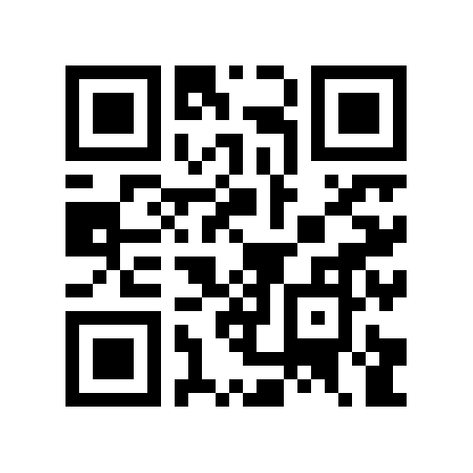

# 条码和二维码的区别

> 原文:[https://www . geesforgeks . org/条形码和二维码的区别/](https://www.geeksforgeeks.org/difference-between-barcode-and-qr-code/)

**1。条形码:**
条形码为我们提供了以计算机可理解的格式存储数字的方法。这用于以 1D 或 2D 格式存储信息，可以扫描以进行数据检索。商店用它来代替毛衣来跟踪病人，以防租车服务，或者跟踪飞机行李中的汽车位置。

**扫描极客的条形码**

**2。** [**二维码**](https://www.geeksforgeeks.org/how-to-generate-and-read-qr-code-with-java-using-zxing-library/) **:**
二维码是以计算机可理解的格式存储数据的一种方式，即可以通过使用二维码扫描仪进行扫描来检索数据。这些现在广泛用于无现金和 UPI 支付服务。它们可用于身份识别，也可用于共享照片、视频和其他文件。

**扫描到 www.geeksforgeeks.org 的二维码**

**条码和二维码的区别:**

<figure class="table">

| 没有。 | 条形码 | 二维码 |
| --- | --- | --- |
| 1. | 它是在 1952 年开发的。 | 它是在 1994 年开发的。 |
| 2. | 它是由诺曼·约瑟夫·伍德兰开发的。 | 它是由原正弘开发的。 |
| 3. | 它有两种类型，一维和二维。 | 它只有一种类型。 |
| 4. | 这是一种以印刷和计算机可理解的格式存储数字的方式。 | 它是一种 2D 条形码或打印的数据表示，可以扫描进行数据检索。 |
| 5. | 它在商店用于追踪所有购买的物品，在医院用于追踪病人的记录，在租车业务中用于追踪航空行李、邮件和核废料。 | 超市、医院、电影院或个人使用。用于传输数据(共享联系人、照片、视频和其他文档)。 |
| 6. | 它基于莫尔斯电码技术。 | 它基于莫尔斯电码技术。 |
| 7. | 它需要视线。 | 它需要视线。 |
| 8. | 与 Fastag 相比，它的数据存储量更少。 | 它比条形码有更多的数据存储。 |
| 9. | 一次只检查一个条形码。 | 一次只检查一个二维码。 |
| 10. | 仅使用条形码进行读取。 | 仅使用条形码进行读取。 |
| 11. | 与 Fastag 相比，它的处理速度较慢。 | 与 Fastag 相比，它的处理速度较慢。 |
| 12. | 它横向存储信息。 | 它横向和纵向存储信息。 |
| 13. | 它是平行线的垂直排列(根据标准版本)。 | 它是正方形网格上正方形点的排列。 |
| 14. | 它存储的信息比二维码少。 | 它存储的信息比条形码多(用于存储多媒体数据)。 |

</figure>