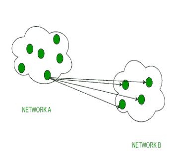

# 广播和组播的区别

> 原文:[https://www . geesforgeks . org/广播和多播的区别/](https://www.geeksforgeeks.org/difference-between-broadcast-and-multicast/)

**1。广播:**
广播传送(一对全)技术，可分为两种类型:有限广播、直接广播。在广播模式下，传输从一台主机传输到局域网上连接的所有其他主机。像 bridge 这样的设备就使用了这个。像 ARP 这样的协议实现了这一点，以便知道主机对应的 IP 地址的媒体访问控制地址。ARP 进行 ip 地址到 mac 地址的转换。RARP 则相反。

**2。[组播](https://www.geeksforgeeks.org/multicasting-in-computer-network/) :**
组播有一个/多个发送方和一个/多个接收方参与数据传输流量。在多播中，流量位于单播和广播的边界之间。它是服务器数据流的直接单一副本，然后被模拟并路由到请求它的主机。IP 组播需要一些其他协议的支持，如互联网组管理协议、组播路由等。而且在有类 IP 寻址中，D 类是为多播组保留的。

**广播和组播的区别:**

| 没有。 | 广播 | 多点传送 |
| 1. | 它有一个发送者和多个接收者。 | 它有一个或多个发送器和多个接收器。 |
| 2. | 它将数据从一台设备发送到网络中的所有其他设备。 | 它将数据从一台设备发送到多台设备。 |
| 3. | 它适用于星型和总线拓扑。 | 它适用于星形、网状、树形和混合拓扑。 |
| 4. | 它可以在大型网络中很好地扩展。 | 它不能在大型网络中很好地扩展。 |
| 5. | 它的带宽被浪费了。 | 它有效地利用带宽。 |
| 6. | 它具有一对一的映射。 | 它有一对多映射。 |
| 7. | 集线器是广播设备的一个例子。 | 交换机是组播设备的一个例子。 |

