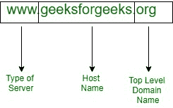

# 域名和网址的区别

> 原文:[https://www . geesforgeks . org/域名与 url 的区别/](https://www.geeksforgeeks.org/difference-between-domain-name-and-url/)

在互联网和网站的世界里，域名和网址是非常常见的术语，可以互换使用，但这两个术语有很大的区别。在本文中，我们将了解域名和网址之间的区别。

**1。** [**域名**](https://www.geeksforgeeks.org/introduction-to-domain-name/) **:**
很难记住服务器的 IP 地址。因此，域名是 IP 地址的文本形式，更人性化，也更容易学习。它是网址的一部分，主要用于组织的品牌宣传。域名的所有部分都用句点或圆点隔开。域名的一个例子是 www.geeksforgeeks.org。域名可以分为以下几个部分。

**服务器类型:**www 或万维网代表网络服务器。

**主机名:**一般是 google、geeksforgeeks 等域名的主名称。

**顶级域名:**域名的最后一部分是顶级域名。例子有。com，。在，中。等等。

**2。** [**统一资源定位器**](https://www.geeksforgeeks.org/url-full-form/) **:**
统一资源定位器被称为 URL。它是一个字符串，提供了网页的完整地址，即也称为网址。为了访问一个特定的网站，你只需要把网址放在搜索栏中就可以找到该网站。例如，谷歌主页的网址是 https://www.google.com/.。网址可以分为不同的部分。

**方法或协议:**这是用于从服务器检索文件的方法或协议。

**主机名:**也称为域名或文件或文档所在服务器的 IP 地址的人性化文本形式。

**端口:**只是一个协议号。它只是一个通信端点。

**路径:**是文件在服务器上的位置。

**域名和网址的区别:**

<figure class="table">

| **序列号** | **域名** | **统一资源定位器** |
| **1。** | 域名的主要动机是为了更容易访问网站。它们更多地被用作品牌，通常被称为品牌名称。 | 如果你想找到一个特定的网站网址是最好的，因为一个网址是一个完整的网址来找到一个特定的网站。 |
| **2。** | 域名是一种人性化的文本形式的 IP 地址。 | URL 是一个字符串，表示任何网页的完整网址。 |
| **3。** | 这是网址中更人性化的部分。 | 它是代表包含域名的完整网址的字符串。 |
| **4。** | 它包含三个部分:顶级域、中级域和低级域。 | 它还包含以下部分的方法、协议、主机名、端口和文件路径。 |
| **5。** | 例子:geeksforgeeks.org | 例子:https://www.geeksforgeeks.org/ |

</figure>