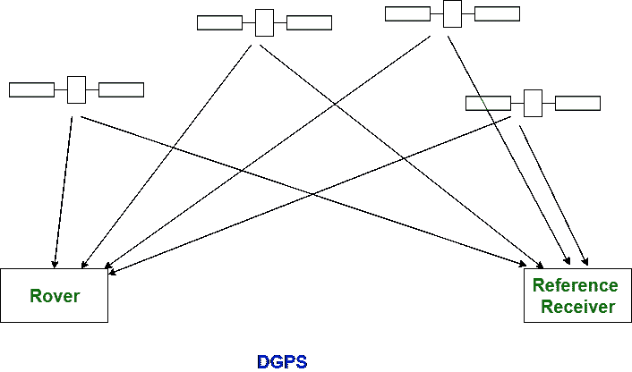

# GPS 和 DGPS 的区别

> 原文:[https://www . geesforgeks . org/GPS 和 dgps 之间的差异/](https://www.geeksforgeeks.org/difference-between-gps-and-dgps/)

**GPS** 代表**全球定位系统。**而 **DGPS** 代表**差分全球定位系统。**两者都用于卫星导航系统。

全球定位系统和 DGPS 之间的根本区别在于，全球定位系统的仪器范围是全球性的。另一方面，DGPS 的乐器系列是地方性的。

**GPS 和 DGPS 的区别:**

| S.NO | 全球（卫星）定位系统 | 差分全球定位系统(Differential Global Positioning System) |
| 1. | 全球定位系统代表全球定位系统。 | DGPS 代表差分全球定位系统。 |
| 2. | 在全球定位系统中，频率从 1.1 千兆赫到 1.5 千兆赫不等。 | 在 DGPS，频率因机构要求而异。 |
| 3. | GPS 使用 **WGS84** ，即用于时间坐标系。 | 而在 DGPS，则使用本地坐标系。 |
| 4. | 全球定位系统的成本比 DGPS 低。 | 而 DGPS 的成本比全球定位系统还要高。 |
| 5. | 全球定位系统的仪器范围是全球性的。 | 而 DGPS 的乐器系列是本地的。 |
| 6. | 在全球定位系统中，只有一个接收器。 | 而在 DGPS，发生了两个接收器。 |