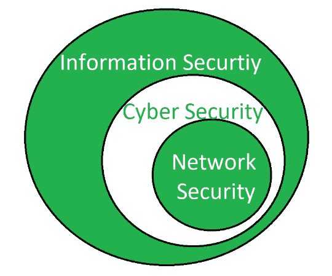

# 网络安全与网络安全的区别

> 原文:[https://www . geesforgeks . org/网络安全与网络安全的区别/](https://www.geeksforgeeks.org/difference-between-network-security-and-cyber-security/)

**[网络安全](https://www.geeksforgeeks.org/network-security/) :**
网络安全是任何企业或组织使用硬件和软件系统来保护其计算机网络和数据安全的措施。这旨在确保数据和网络的保密性和可访问性。每个处理大量数据的公司或组织都有一定程度的解决方案来应对许多网络威胁。

**[网络安全](https://www.geeksforgeeks.org/cyber-safety/) :**
网络安全是保护我们的系统免受网络攻击和恶意攻击的措施。它基本上是为了提高我们系统的安全性，这样我们就可以防止攻击者未经授权访问我们的系统。它保护网络空间免受攻击和破坏。网络空间可能会受到固有漏洞的阻碍，这些漏洞有时无法消除。

**网络安全与网络安全的区别:**

| 网络安全性 | 网络安全 |
| --- | --- |
| 它保护网络上流动的数据。 | 它保护驻留在设备和服务器中的数据。 |
| 它是网络安全的一个子集。 | 它是信息安全的一个子集。 |
| 它保护网络领域的任何东西。 | 它保护网络领域的任何东西。 |
| 它处理防御拒绝服务攻击。 | 它涉及保护免受网络攻击。 |
| 网络安全部门打击特洛伊木马。 | 网络安全打击网络犯罪和网络欺诈。 |
| 它包括病毒和蠕虫。 | 它包括网络钓鱼和预发短信。 |
| 网络安全确保只保护传输数据。 | 网络安全确保保护整个数字数据。 |
| 它保护终端通过网络传输的数据。 | 它涉及数据的保护。 |

