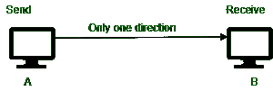

# 单工传输模式和半双工传输模式的区别

> 原文:[https://www . geesforgeks . org/单工传输模式和半双工传输模式的区别/](https://www.geeksforgeeks.org/difference-between-simplex-transmission-modes-and-half-duplex-transmission-modes/)

先决条件–[计算机网络中的传输模式](https://www.geeksforgeeks.org/transmission-modes-computer-networks/)

**1。单工模式:**

单工模式如同在单行道上，通信是单向的，如同在单行道上。在这种情况下，链路上的两个设备中只有一个可以传输，另一个只能接收。这种模式是利用信道的全部容量向一个方向发送数据。

示例:-键盘和显示器。

**2。半双工模式:**

半双工模式是指发送方可以发送数据，也可以一次只接收一个数据。它是双向的，即双向通信，但一次只能有一个。

例子:-对讲机。

**单工传输模式和半双工传输模式的区别:**

<figure class="table">

| **先生否** | **单工模式** | **半双工模式** |
| 1. | 发送方可以发送数据，但不能接收数据。 | 发送者可以发送和接收数据，但一次只能完成一项任务。 |
| 2. | 在单工模式下，数据流是单向的。 | 在半双工中，数据流是双向的，但一次只能有一个。 |
| 3. | 在这种情况下，带宽利用率最高。 | 在这种情况下，传输过程中的带宽利用率较低。 |
| 4. | 单工模式的性能比全双工模式差。 | 半双工模式提供的性能低于全双工模式。 |
| 5. | 在这种情况下，一个站是发射机，另一个是接收机。在这里，信息是一种方式，即只有发送器发送数据或信息。 | 在这种情况下，两个系统通过点对点链路连接，以发送和接收信号。两端一次只能传输一个信号。 |
| 6. | 键盘和传统显示器是单工模式的例子。 | 对讲机和文本消息是半双工模式的例子。 |

</figure>