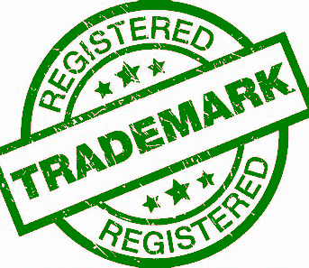

# 商标和域名的区别

> 原文:[https://www . geesforgeks . org/商标和域名的区别/](https://www.geeksforgeeks.org/difference-between-trademark-and-domain-name/)

**1。商标:**
商号是一个用来将企业注册为其经营所在州的法人实体的名称。通常，这通常是在国务卿或公司部，或一个相同的国营机构完成的。商标名称在注册地必须是唯一的。为了联邦税法的目的，该商标还在国内税务局注册。

商标可以是图形表示的标志或符号，它能够将一个企业的产品或服务与其他企业的产品或服务区分开来。商标注册申请应当向房产部门商标注册处提出)。注册商标的所有人有权参照该商标在香港特别行政区注册的产品和服务使用该商标。

**例:**
当一个组织的官员签署一份协议时，他以“XYZ 公司的首席财务官”的身份签字任何想了解该法人地位的人都可以根据 XYZ 公司所在州当年的记录对其进行询问。出于这个原因，合同通常会说明合同的一方，并包括类似这样的内容:“特拉华州负债公司”，因为这些信息允许某人研究企业的状态。

**2。域名:**
域名是数据库中的一个条目，就像电子表格中的一行。该条目对应于一个在线协议地址。网站名称可以是为您提供网站标识的网站地址。网站名称可以是人类可读的互联网地址，例如 www.wilmerhale.com。它是用户/客户在他们的互联网浏览器中输入的名称，用于访问您的网站。网站名称的正确使用是由名称注册商管理的。

您将通过向注册服务商购买您的特定名称来获得网站名称。以国家代码顶级域名(例如 com.hk)或通用顶级域名(例如。com)应发送给至少一个注册服务商。如果网站名称的功能是发现特定商品或服务的来源，它通常可以注册为商标。

**例如:**
它包括在提供服务的互联网网站的特定页面上使用该名称，将该名称离线用作相当于网址的东西，例如在服务的营销或促销材料上使用该名称，以及在产品的包装上使用该名称。

**商标与域名的区别:**

<figure class="table">

| S.NO | 特征 | 域名 |
| --- | --- | --- |
| 1. | 商标可以由文字、图案、字母、数字、颜色、商品形状或包装等组成。以及这些标志的任意组合。 | 域名必须与的上下文相关(例如 www.ipd.gov.hk)。 |
| 2. | 商标将根据尼斯分类中的商品或服务进行注册。 | 域名不必为特定类别的商品或服务注册。 |
| 3. | 注册商标的有效期为 10 年，可以再续展 10 年。 | 域名仅在注册人和注册服务商之间约定的特定期限内有效，并且这些期限可以续期。 |
| 4. | 如果商标与先前注册的商标不同或相似，则该商标可能不可注册。 | 如果域名与以前注册的域名没有区别，则可以注册。 |
| 5. | 仅由描述商品或服务特性的标志或符号组成的商标可能不可注册。面包店服务中的“新鲜面包”等符号。 | 域名可以描述商品或服务的应用特征，例如面包店的“freshbread.com”。 |
| 6. | 商标在现实世界中运作。 | 域名在网络世界中运作。 |
| 7. | 生活在不同国家的不同人可能对不同的商品和服务拥有相同的商标，因为它通常不会对全球产生影响。 | 域名在全球范围内运作，因此没有两家公司/个人可以拥有相同的域名。 |
| 8. | 商标可以指或链接到特定类别的产品或产品线。 | 域名不是公司提供的每一个产品的名称。 |
| 9. | 由于不存在管辖权问题，与商标相关的争议很容易解决。 | 由于互联网非常广泛，没有任何界限，所以争议很难解决。 |

</figure>