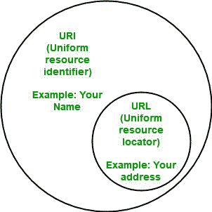

# URL 和 URI 的区别

> 原文:[https://www . geesforgeks . org/URL 和 uri 之间的区别/](https://www.geeksforgeeks.org/difference-between-url-and-uri/)

**URL(统一资源定位符):**
[URL(统一资源定位符)](https://www.geeksforgeeks.org/url-full-form/)通常被定义为指向某个地址的字符串。这是一种在网上查找资源的常用方法。它通过描述物理位置的网络位置或主要访问机制，提供了一种检索物理位置表示的方法。

该协议在用于检索资源和资源名称的 URL 中描述。如果资源可能是 web 类型的资源，则 URL 在开始时包含 http/https。同样，如果资源可能是文件，它以 ftp 开头，如果资源是电子邮件地址，它以 mailto 开头。网址的语法如下所示，其中主要部分用于协议，其余部分用于由网站名或程序名组成的资源。

```
https://www.geeksforgeeks.org/minimum-cost-graph
```

这里，域名描述了服务器(web 服务)和程序名(服务器上目录和文件的路径)。

**URI(统一资源标识符):**
与 URL 类似，URI(统一资源标识符)也是一个字符串，通过使用位置、名称或两者来标识网络上的资源。它允许统一识别资源。URI 还被分为定位器、名称或两者，这表明它可以描述网址、URN 或两者兼而有之。URI 境内的标识符一词指的是资源的重要性，尽管使用了某种技术。

在 URI，前一个类别是 URL，在此期间，使用协议来指定资源的访问方法，并且在 URL 中附加地布局资源名称。网址可能是 URI 的一种非持久性类型。要求 URN 具有全球唯一性，并具有全球范围。



**URL 和 URI 的区别:**

<center>

| 统一资源定位器 | 上呼吸道感染 |
| --- | --- |
| URL 用于描述项目的身份。 | URI 提供了一种定义物品身份的技术。 |
| 在访问协议等方法的帮助下，URL 链接网页、网页组件或网页上的程序。 | 无论使用何种方法，URI 都被用来区分一种资源和另一种资源。 |
| URL 提供了将要使用的协议类型的详细信息。 | URI 不包含协议规范。 |
| 网址是 URI 的一种。 | URI 是网址的超集。 |

</center>