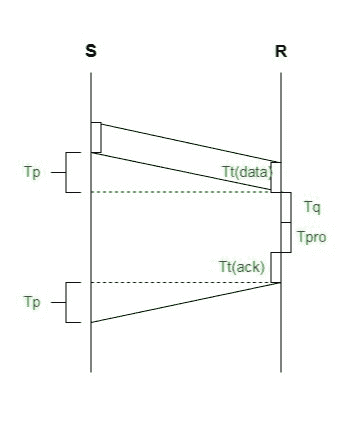

# 停止和等待协议的效率

> 原文:[https://www . geesforgeks . org/stop-and-wait-protocol 的效率/](https://www.geeksforgeeks.org/efficiency-of-stop-and-wait-protocol/)

**停止等待**是一个流量控制协议。其中发送方发送一个数据包，等待接收方确认，然后发送下一个数据包。如果没有收到确认，发送方将重新发送数据包。这是最简单也是最容易实现的。但主要缺点是效率很低。



发送一个数据包所用的总时间，

```
= Tt(data) + Tp(data) + Tq + Tpro + Tt(ack) + Tp(ack)

Since,
Tp(ack) = Tp(data)

And,
Tt(ack) << Tt(data).

So we can neglect Tt(ack)
Tq = 0 and Tpro = 0

Hence, 
Total time = Tt(data) + 2 * Tp 
```

哪里，

```
Tt(data) : Transmission delay for Data packet
Tp(data) : propagation delay for Data packet
Tq: Queuing delay
Tpro: Processing delay
Tt(ack): Transmission delay for acknowledgment
Tp(ack) : Propagation delay for acknowledgment 
```

我们知道**效率(η)** ，

```
= Useful time / Total cycle time.
= Tt / (Tt + 2*Tp)
= 1 / (1+2*(Tp/Tt))
= 1 / (1+2*a) 

where, 
a = Tp / Tt 
```

**吞吐量:**每秒发送的位数，也称为有效带宽或带宽利用率。

```
Throughput, 
= L/(Tt + 2*Tp)
= ((L/BW)*BW)/(Tt + 2*Tp)
= Tt/(Tt + 2*Tp) * BW
= 1/(1 + 2a) * BW

Hence, Throughput 
= η * BW

where,
BW : BandWidth
L : Size of Data packet 
```

**影响效率的因素:**

```
n = 1/(1 + 2*(Tp/Tt)
= 1/(1 + 2*(d/v)*(BW/L))

where,
d = distance between source and receiver 
v = velocity 
```

让我们看一个例子。

**例:**
给定，

```
Tt = 1ms    
Tp = 2ms   
Bandwidth = 6 Mbps

Efficiency(η) 
= 1/(1 + 2*a)
= 1/(1 + 2*(2/1))
= 1/5  
= 20 %

Throughput 
= η * BW
= (1/5) * 6 
= 1.2 Mbps 
```

**注:**
从上面给出的效率公式中我们可以观察到:

1.  当增加源和接收器之间的距离时，效率会降低。因此，停止和等待只适用于像局域网这样的小区域网络。它不适合城域网或广域网，因为效率会很低。
2.  如果我们增加数据包的大小，效率将会提高。因此，它不适合小数据包。“停止并等待”可以高效地发送大数据包。