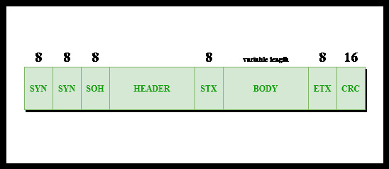

# 双同步的帧格式

> 原文:[https://www.geeksforgeeks.org/frame-format-of-bisync/](https://www.geeksforgeeks.org/frame-format-of-bisync/)

[二进制同步通信协议(BISYNC)](https://www.geeksforgeeks.org/binary-synchronous-communication-bisync/) 是 IBM 开发的面向字节的通信协议和数据链路层协议。在面向字节的方法中，每一帧都被视为一组字节/字符。

一些受欢迎的面向字节的协议有–

1.  二进制同步通信协议
2.  [点对点协议(PPP)](https://www.geeksforgeeks.org/ppp-full-form/)
3.  数字数据通信消息协议

BISYNC 也被称为 BSC。BISYNC 遵循哨点方法。哨兵方法是一种保护行为，由帧格式的某些字段展示。

**BISYNC 的帧格式:**

*   BISYNC 在帧的开始有两个(BI)同步场(SYNC)。
*   帧格式包括两个各 8 位的同步字段。这两个字段对于确定帧的开头至关重要。
*   第三个字段是 SOH(报头开始)，由 8 位组成，后面是第四个字段——报头。
*   第五个字段是 STX(文本的开始)，它由 8 位组成，后跟一个可变长度的正文。
*   正文之后是 ETX(正文结尾)，共 8 位。
*   循环冗余校验(CRC)是 16 位的最后一个字段，这是错误检测所必需的。
*   从最左边的字段开始传输帧。
*   帧的开始通过发送一个特殊的同步字符来表示。
*   帧的数据部分包含在特殊的哨兵字符 STX 和 ETX 之间，即身体由 STX & ETX 保护。

**STX 和 ETX :**

*   如果接收者在身体内遇到了 STX 或 ETX，它会误认为他们是真正的 STX 或 ETX。
*   这个问题，可以用字节/字符填充的方法来处理。

**注意–**
我们在这里使用字节/字符填充方法，因为它是一个面向字节的协议，采用了面向字符的方法。在面向比特的协议中，我们使用比特填充方法。

*   字节/字符填充方法可以定义为每当文本中有一个标志或转义字符时，添加一个额外字节的过程。
*   一个标志/转义字符，比如 SYN/STX/ETX，如果在正文中重复出现两次，将会增加一个字节。
*   这个字节/字符填充过程由 BISYNC 协议中的 DLE(数据链转义)处理。DLE 字符是用于在框架中携带不可打印字符的字符。