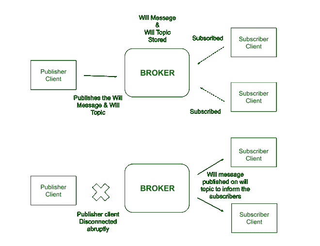

# MQTT 的基本特征|第 3 集

> 原文:[https://www . geesforgeks . org/foundation-features-of-mqtt-set-3/](https://www.geeksforgeeks.org/fundamental-features-of-mqtt-set-3/)

**先决条件–**

*   [消息队列遥测传输协议(MQTT)](https://www.geeksforgeeks.org/introduction-of-message-queue-telemetry-transport-protocol-mqtt/)
*   [MQTT 的基本特征|第 1 集](https://www.geeksforgeeks.org/fundamental-features-of-mqtt/)
*   [MQTT 的基本特征|第 2 集](https://www.geeksforgeeks.org/fundamental-features-of-mqtt-set-2/)

**最后遗嘱:**
在 MQTT 中，发布者客户端向 Broker 发布特定主题的消息。然后，代理将这些消息发布给订阅该主题的客户端。如果发布者/订阅者客户端想要结束与代理的连接，它会发送 DISCONNECT 消息。这样，通信可以优雅地断开。

但是有几种情况下客户端可能会突然断开连接。在这种情况下，客户端结束与代理的通信，而不发送 DISCONNECT 消息。在这种情况下，其他客户端将不会被告知失败，因此他们将继续等待来自断开客户端的消息。

**客户端可能由于以下任何原因突然断开连接–**

*   由于连接丢失或硬件故障，底层网络出现故障。
*   无法在保持活动期内发送消息。

为了解决这样的问题，使用了*最后一条消息*的概念。使用此功能，客户端提供预定义的*将在首次连接到代理时发送消息*。该消息由代理存储。

*   如果客户端突然断开连接，broker 将为所有订阅的客户端在主题上发布消息。
*   如果客户端正常断开连接，代理将丢弃该消息。

**LWT 留言和 LWT 话题:**

*   LWT 消息将待发布的消息定义为*最后将*发布给订阅的客户端。
*   LWT 主题定义了最后一条遗嘱信息发布的主题。

[](https://media.geeksforgeeks.org/wp-content/uploads/20200803162417/WillmessageGeeksforGeeks-660x508.png) 

<center>**Figure –** Last Will and Testament</center>

**Example –**

[](https://media.geeksforgeeks.org/wp-content/uploads/20200803164426/LastWillGeeksforGeeks.png) 

<center>**Figure –** Mosquitto Illustration of Last Will and Testament</center>

In the above illustration, will topic is “sensor/status” and will message is “offline”. Once client disconnects abruptly, socket error is displayed on mosquito broker terminal. Hence broker then sends will message “offline” to client subscribed to topic “sensor/status”.

**莫斯奇托命令:**

*   **最后一个遗嘱主题(强制)–**
    如果未提供其他参数，则仅发布最后一个遗嘱主题将向已订阅的客户端发布非保留的零长度消息(QoS0)。

    ```
    --will-topic
    ```

*   **最后一条遗嘱信息(可选)–**
    默认为长度为零的空信息。

    ```
     --will-payload
    ```

*   **最后意愿服务质量(可选)–**
    默认为服务质量 0。

    ```
    --will-qos
    ```

*   **最后遗嘱保留(可选)–**
    默认保留为假。

    ```
    --will-retain
    ```